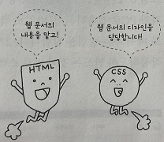
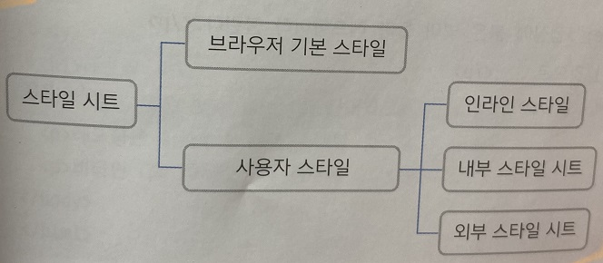

***
# CSS의 기본

HTML이 텍스트나 이미지, 표 같은 요소를 웹 문서에 넣어 뼈대를 만드는 역할을 한다면 

CSS는 텍스트나 이미지, 배경의 크기나 배치 방법 등의 요소를 이용하여 디자인을 담당한다.

***
## 웹 문서에 디자인 입히기

웹에서는 미리 약속한 스타일 속성을 입력해 디자인한다.
***
### 왜 스타일을 사용할까?

웹 문서에서 스타일이란 HTML 문서에서 자주 사용하는 글꼴이나 색상, 정렬, 각 요소의 배치 방법과 같이 문서의 겉모습을 결정짓는 것을 가리킨다.

그런데 이런 작업을 HTML로 하지 않고 따로 스타일을 사용하는 이유가 무엇일까

1) 웹 문서의 내용과 상관없이 디자인만 바꿀 수 있다.

HTML로는 웹 사이트의 내용을 나열하고 CSS로는 웹 문서의 디자인을 구성한다는 아이디어가 바로 웹 표준의 시작이다.

이렇게 내용과 디자인이 구분되어 있으면 사이트의 내용을 수정할 때에도 디자인에 전혀 영향을 미치지 않아 편리하다.

2) 다양한 기기에 맞게 탄력적으로 바뀌는 문서를 만들 수 있다.

기존 HTML 문서는 PC의 웹 브라우저 화면이 기본으로 되어 있어 인쇄하려면 용지에 맞게 따로 작성해야 했다. 

또한 모바일용 홈페이지가 필요할 경우에도 스마트폰 브라우저에 적합하게 문서를 따로 만들어야 했다. 

하지만 CSS를 이용하면 HTML로 작성한 내용은 그대로 두고 대상 기기에 맞게 CSS만 바꿔 주면 같은 내용을 여러 기기에서 볼 수 있다.

<b>반응형 웹 디자인</b>이란 사용자가 PC로 접속하든, 모바일로 접속하든 웹 브라우저의 크기에 따라 화면 레이아웃을 자동으로 바꿔 주는 방법을 말한다.

2가지 문서를 따로 만드는 것이 아니라 하나의 웹 문서에서 작동하도록 만드는 것이 바로 스타일의 역할이다.

***
## 스타일과 스타일 시트
***

### 스타일 형식 알아보기

CSS 소스에서 한 줄이 하나의 스타일에 해당하고, 조금 더 들여다 보면 줄마다 형태가 비슷하다는 걸 알게 될 것이다.

    - 기본형
    선택자 {속성1 : 속성값1; 속성2 : 속성값2 ...}

맨 앞의 선택자는 스타일을 어느 태그에 적용할 것인지 알려 주는 것이고, 중괄호 {} 사이에는 스타일 정보를 넣는다.

속성과 값이 하나의 쌍으로 이루어진 것을 스타일 규칙이라고 하며, 세미콜론 ; 으로 구분해서 스타일 규칙을 여러 개 지정할 수 있다.

### 스타일 작성 방법

스타일 규칙은 세미콜론 ; 으로 구분하여 중괄호 {} 안에 나열한다고 했는데, 이때 사용할 스타일 속성이 여러 개일 경우

한 줄에 속성을 하나만 적는 것이 이해하기도 편하고 오른쪽에 주석을 붙여 소스를 관리하기에도 좋다.

하지만 CSS 소스가 길어지지 않도록 중괄호 {} 사이에 스타일 규칙을 한 줄로 표기하기도 한다.

### 스타일의 주석을 표기하는 방법

태그에서 주석을 사용한 것처럼 스타일에도 주석을 덧붙일 수 있다. 주석을 표시할 때는 /* 와 */사이에 내용을 입력하는데 , 이때 내용이 한 줄 또는 여러 줄이 들어갈 수도 있다.

***

! CSS 소스 경량화

CSS 소스에 주석을 넣거나 줄 바꿈하는 것은 웹 사이트 작성자가 알아보기 쉽도록 하는 것일 뿐 웹 브라우저에는 아무 의미가 없다.

웹 브라우저에서 CSS 소스를 읽을 때는 선택자와 속성, 그리고 속성값만 의미가 있다. 

하지만 CSS 소스는 네트워크를 이용해 파일로 내려받으므로 되도록이면 파일 크기가 작은 것이 좋다. 

그래서 CSS 소스가 길면 주석이나 줄 바꿈, 공백 등을 제거하고 꼭 필요한 정보만 남겨서 파일을 작게 만들어 사용하는데 

이것을 CSS 소스 경량화(minify)라고 한다.

인터넷에서 css minify 또는 css compress를 검색하면 CSS 소스 파일의 크기를 줄여 주는 다양한 툴을 찾을 수 있다.

***

### 스타일 시트 알아보기

웹 문서 안에서는 스타일 규칙을 여러 개 사용한다.

이런 스타일 규칙을 한눈에 확인하고 필요할 때마다 수정하기도 쉽도록 한군데 묶어 놓은 것을 <b>스타일 시트</b>라고 한다.

스타일 시트는 크게 웹 브라우저에 기본으로 만들어져 있는 브라우저 기본 스타일과 사이트 제작자가 만드는 사용자 스타일로 나눌 수 있다. 

사용자 스타일은 다시 인라인 스타일과 내부 스타일 시트, 외부 스타일 시트로 나뉜다.

***
#### 브라우저 기본 스타일

CSS를 사용하지 않은 웹 문서라 하더라도 웹 브라우저에 표시할 때는 기본 스타일을 사용하는데, 이것을 브라운저 기본 스타일이라고 한다.

브라우저에서 미리 정해 놓은 스타일이다.

#### 간단한 스타일 정보를 적용하는 인라인 스타일

간단한 스타일 정보라면 스타일 시트를 사용하지 않고 스타일을 적용할 대상에 직접 표시한다.

이러한 방법을 <b>인라인 스타일</b>이라고 하는데, 

스타일을 적용하고 싶은 부분이 있다면 해당 태그에 style속성을 사용해 style="속성:속성값;" 형태로 스타일을 바꿀 수 있다.

#### 스타일을 여러 곳에 적용할 때 쓰는 내부 스타일 시트

웹 문서 안에서 사용할 스타일을 같은 문서 안에 정리한 것을 <b>내부 스타일 시트</b>라고 한다.

스타일 정보는 웹 문서를 브라우저 화면에 표시하기 전에 결정해야 하므로 모든 스타일 정보는 head태그 안에서 정의하고 style과 /style태그 사이에 작성한다.

#### 스타일 정보를 따로 저장해 놓은 외부 스타일 시트

웹 사이트를 만들 때 하나의 웹 문서로 끝나는 경우는 거의 없다. 

대부분 디자인에 일관성이 있도록 같은 스타일을 여러 웹 문서에 사용하는데, 그때마다 웹 문서를 똑같은 내부 스타일 시트로 만든다면 서버 공간은 물론 문서를 내려받는 시간까지 낭비한다.

따라서 사이트는 제작할 때는 여러 웹 문서에서 사용할 스타일을 별도 파일로 저장해 놓고 필요할 때 마다 가져와서 사용하는 것이 일반적이다. 

이렇게 따로 저장해 놓은 스타일 정보를 외부 스타일 시트라 하고 -.css라는 파일 확장자를 사용한다.

외부 스타일 시트 파일에 스타일을 작성할 때는 style태그를 사용하지 않는다.

그리고 이렇게 만든 외부 스타일 시트는 웹 문서에 연결해야 스타일이 문서에 적용된다.

HTML파일에서 스타일 시트를 링크한다.

외부 스타일 시트를 연결할 때 사용하는 태그는 link태그다.

    - 기본형
    <link rel="stylesheet" href="외부 스타일 시트 파일 경로">

***