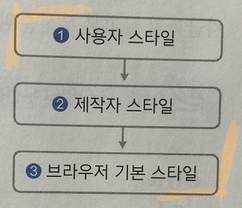
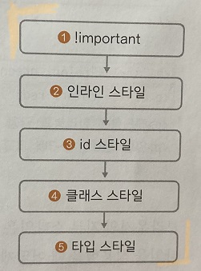

***
## 캐스케이딩 스타일 시트 알아보기
***
CSS와 스타일 시트는 비슷해 보이지만 조금 차이가 있다.

쉽게 말해 '스타일 시트'라는 용어 앞에 '캐스케이딩'이라는 용어가 하나 더 붙은 것이 CSS인데

CSS에 담긴 캐스케이딩은 무엇을 의미하고 어떤 역할을 하는지 알아보자
***

### 캐스케이딩의 의미

CSS에서 C는 캐스케이딩의 줄임말이면 스타일 시트에서는 우선순위가 위에서 아래, 즉 계단식으로 적용된다는 의미로 사용한다.

다시 말해 CSS는 우선순위가 있는 스타일 시트 라고 해석할 수 있다.

그래서 CSS에서는 웹 요소에 둘 이상의 스타일을 적용할 때 우선순위에 따라 적용할 스타일을 결정한다.

캐스케이딩은 스타일끼리 충돌하지 않도록 막아 주는 중요한 개념이다.

스타일이 충동하지 않게 하는 방법으로 다음 2가지 방법이 있다.

    - 스타일 우선순위 : 스타일 규칙의 중요도와 적용 범위에 따라 우선순위가 결정되고, 그 우선순위에 따라 위에서 아래로 스타일을 적용한다.

    - 스타일 상속 : 태그의 포함 관계에 따라 부모 요소의 스타일을 자식 요소로, 위에서 아래로 전달한다.

***

### 스타일 우선순위

첫 번째 원칙인 스타일 우선순위는 캐스케이딩에서 가장 중요하다.

우선순위란 어떤 스타일을 먼저 적용할 것인지 결정하는 규칙을 말한다.

그리고 우선순위는 다음 3가지 개념에 따라 지정된다.

***

1) 얼마나 중요한가

웹 브라우저에 내용을 표시할 때에는 단순히 CSS 소스의 스타일만 적용되는 것이 아니다.

컴퓨터 사용자가 지정한 스타일과 웹 문서를 제작한 제작자의 스타일, 그리고 웹 브라우저가 기본으로 정해 놓은 스타일

이렇게 3가지 스타일을 함께 사용한다.

가장 중요한 스타일은 사용자 스타일이다.

그리고 이어서 제작자 스타일이 중요하고 마지막으로 브라우저 기본 스타일 순이다.

***
2) 적용 범위는 어디까지 인가?

중요도가 같은 스타일 이라면 스타일 적용 범위에 따라 우선순위를 정할 수 있다.

스타일 적용 범위가 좁을수록, 즉 정확히 필요한 요소에만 적용할 스타일 일수록 우선 순위가 높아진다.

단, 여기에서 스타일 규칙에 !important를 붙이면 그 스타일은 다른 스타일보다 우선순위가 높아진다.

    - !important : 어떤 스타일보다 우선 적용하는 스타일
    - 인라인 스타일 : 태그 안에 style속성을 사용해 해당 태그만 스타일을 적용
    - id 스타일 : 지정한 부분에만 적용되는 스타일이지만 한 문서에 한 번만 적용 ( 선택자 이름앞에 # 기호)
    - 클래스 스타일 : 웹 문서에서 지정한 부분에만 적용되는 스타일로 한 문서에 여러 번 적용 가능 ( 선택자 이름앞에 . 기호)
    - 타입 스타일 : 웹 문서에 사용한 특정 태그에 스타일을 똑같이 적용

***
3) 소스 코드의 작성 순서는 어떠한가?

스타일 시트에서 중요도와 적용 범위가 같다면 그 다음은 스타일을 정의한 소스 순서로 우선순위가 정해진다.

소스에서 나중에 작성한 스타일이 먼저 작성한 스타일을 덮어쓴다.

***

### 스타일 상속

웹 문서에서 사용하는 여러 태그는 서로 포함 관계가 있다.

이때 포함하는 태그를 부모 요소, 포함된 태그를 자식 요소라고 한다.

스타일 시트에서는 자식 요소에서 별도로 스타일을 지정하지 않으면 부모 요소의 스타일 속성들이 자식 요소로 전달되는데,

이것은 스타일 상속이라고 한다.

예를 들면 body태그는 웹 문서에 사용한 모든 태그의 부모 요소이다.

그래서 body태그 스타일에서 글자색이나 글꼴을 지정하면 그 스타일은 웹 문서 전체에 적용 할 수 있다.

부모 요소의 스타일이 자식 요소에게 그대로 상속되기 때문이다.

! 배경색과 배경 이미지는 스타일 상속이 되지않는다. 또한 스타일 상속만으로 모든 스타일의 충돌을 막을 수는 없다.

***

