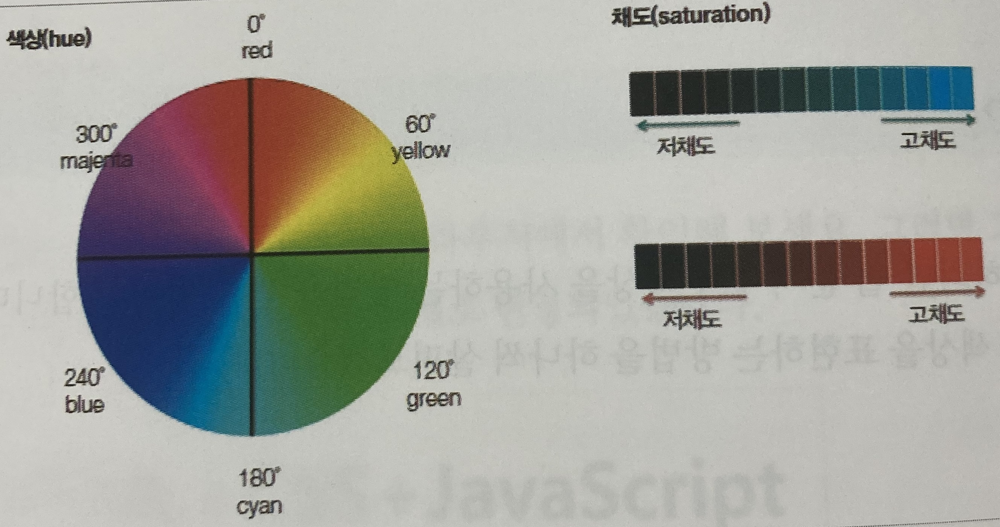

***
## 텍스트 관련 스타일

글꼴과 텍스트 스타일은 비슷해 보이는데 다르다.

글꼴이 폰트와 관련된 내용이었다면 텍스트 스타일은 글자와 단어, 그리고 글자로 이루어진 문단에서 사용하는 스타일이다.
***

### 글자색을 지정하는 color속성

웹 문서에서 문단이나 제목 등의 텍스트에서 글자색을 바꿀 때는 color속성을 사용한다.

color를 사용할 수 있는 속성값은 16진수나 rgb,rgba,hsl,hsla 또는 색상 이름 이다.

    - 기본형
    color : 색상

***

### 16진수로 표현하는 방법

웹 문서의 CSS에서 색상을 표현하는 첫 번째 방법은 #ffff00 처럼 #기호 다음에 6자리의 16진수로 표시하는 것이다.

16진수는 0~f까지 16개의 숫자로 크기를 나타낸다. 

가장 작은 수는 0이고 가장 큰 수는 f이다.

6자리의 16진수는 앞에서부터 두 자리씩 묶어 #RRGGBB로 나타내는데,

RR자리에는 빨간색, GG자리에는 초록색, BB자리에는 파란색의 양을 표시한다.

각 생상마다 하나도 섞이지 않았음을 표시하는 00부터 

해당 색이 가득 섰였음을 표시하는 ff까지 사용할 수 있다.

만약 색상값이 #0000ff처럼 두 자리씩 중복될 경우 #00f로 줄여서 표기 할 수도 있다.

색상을 나타내는 16진수의 값을 모두 기억하고 있을 수 없으므로 주로 색상값을 추출해 주는 컬러 피커(color picker)를 사용한다.

### hsl과 hsla로 표현하는 방법

CSS3에서는 hsl을 사용홰서 색상을 표기할 수 있다. hsl은 hue(색상), saturation(채도), lightness(명도)의 줄임말이다.

hsla는 hsl에 alpha(불투명도)를 추가한 것을 의미 한다.

hue는 다음과 같이 각도를 기준으로 색상을 둥글게 배치한 색상환으로 표시한다.

채도는 퍼센트로 표시하는데 아무것도 섞이지 않으면 채도가 가장 높은 상태이다.

명도 또한 퍼센트로 표시하는데 0%는 가장 어둡고, 50%는 원래색, 100%는 흰색으로 나타난다.

여기에 알파값을 더해 hsla(0,100%,50%,0.5)라고 하면 빨간색을 절반쯤 투명하게 만든다.

### 색상을 영문명으로 표현하는 방법

색상을 표기하는 또 다른 방법으로 red, yellow, black처럼 잘 알려진 색상 이름을 사용하는 것이다.

이름을 모두 기억하기는 쉽지 않으므로 white, black, red와 같이 자주 사용하는 색상일 경우 색상 이름 그대로 사용하기도 한다.

### rgb와 rgba로 표현하는 방법

CSS에서는 색상을 지어할 때 주로 rgb와 rgba로 표현한다.

rgb는 red, green, blue의 줄임말이며,

하나도 섞이지 않았을 때는 0으로 표시하고 가득 섞였을 때는 255로 표시하며 그 사이의 값으로 각 색상의 양을 나타낸다.

그리고 rgba를 사용하면 rgb로 표현한 색상에 불투명도를 지정할 수도 있다.

맨 끝의 alpha는 불투명도의 값을 나타내며 0~1의 값 중에서 사용할 수 있다.

1은 완전히 불투명한 것이고, 0이 되면 완전히 투명해 진다.

***

### 텍스트를 정렬하는 text-align속성

text-align속성은 문단의 텍스트 정렬 방법을 지정한다.

text-align속성을 사용하면 워드나 한글 문서에서 흔히 사용하는 왼쪽 정렬, 오른쪽 정렬, 양쪽 정렬, 가운데 정렬 등을 웹 문서에서도 지정할 수 있다.

    - 기본형
    text-align: start | end | left | right | center | justify | match-parent

|종류|설명|
|----|----|
|start|현재 텍스트 줄의 시작 위치에 맞추어 문단을 정렬한다.|
|end|현재 텍스트 줄의 끝 위치에 맞추어 문단을 정렬한다.|
|left|왼쪽에 맞추어 문단을 정렬한다.|
|right|오른쪽에 맞추어 문단을 정렬한다.|
|center|가운데에 맞추어 문단을 정렬한다.|
|justify|양쪽에 맞추어 문단을 정렬한다.|
|match-parent|부모 요소를 따라 문단을 정렬한다.|

 
정렬 방법을 지정하지 않을 경우 왼쪽 정렬이 기본이다.

왼쪽 정렬에서는 오른쪽에 여백이 생기지만 양쪽 정렬에서는 오른쪽에 여백이 생기지 않는다는 차이가 있다.

***

### 줄 간격을 조절하는 line-height속성

한 문단이 두 줄을 넘으면 줄 간격이 생긴다.

줄 간격이 너무 좁거나 넓으면 가독성이 떨어지는데, 이때 line-height속성을 이용하면 줄 간격을 원하는 만큼 조절할 수 있다.

줄 간격은 정확한 단위로 크기값을 지정하거나 문단의 글자 크기를 기준으로 몇 배수인지 백분율로 지어할 수도 있다.

예를 들면 글자 크기가 12px인 문단의 줄 간격을 2.0으로 했다면 실제 줄 간격은 글자 크기의 2.0배인 24px이 되며 백분율도 같은 식으로 계산한다.

보통 줄 간격은 글자 크기의 1.5~2.0배면 적당하다.

    - 예제. 줄 간격 24px로 지정해 보기

    p { font-size: 12px; line-height: 24px;}
    p { font-size: 12px; line-height: 2.0;}
    p { font-size: 12px; line-height: 200%;}

줄 간격은 텍스트를 세로 정렬할 때도 유용하다.

세로로 가운데 정렬을 하려면 line-height의 속성값을 추가하여 영역의 높이를 나타내는 height의 속성값과 똑같이 지정하면 된다.

***
### 텍스트의 줄을 표시하거나 없애 주는 text-decoration속성

text-decoration속성은 텍스트에 밑줄을 긋거나 취소선을 표시한다.

그리고 텍스트에 하이퍼링크를 적용하면 기본적으로 밑줄이 생기는데 text-decoration속성을 사용하면 없앨 수 있다.

    - 예제. 텍스트에 줄 표시하기
    <body>
        
텍스트에 줄을 표시하지 않음

        
밑줄 표시

        
윗줄 표시

        
취소선 표시

    </body>

***
### 텍스트에 그림자 효과를 추가하는 text-shadow속성

텍스트에 그림자 효과를 추가해 텍스트를 좀더 입체감 나게 보여 줄 수 있다.

    - 기본형
    text-shadow: none | <가로 거리> <세로 거리> <번짐 정도> <색상>

다음 표는 텍스트에 그림자 효과를 줄 때 사용할 수 있는 text-shadow속성값의 종류를 정리 한 것이다.

|종류|설명|
|----|----|
|가로 거리|텍스트부터 그림자까지의 가로 거리로 필수 속성이다. 양숫값은 글자의 오른쪽, 음숫값은 글자의 왼쪽에 그림자를 만든다.|
|세로 거리|텍스트부터 그림자까지의 세로 거리로 필수 속성이다. 양숫값은 글자의 아래쪽, 음숫값은 글자의 위쪽에 그림자를 만든다.|
|번짐 정도|그림자가 번지는 정도이다. 양숫값을 사용하면 그림자가 모든 방향으로 퍼져 나가므로 그림자가 크게 표시되고, 반대로 음숫값은 그림자가 모든 방향으로 축소되어 보인다. 기본값은 0이다.|
|색상|그림자 색상을 지정한다. 한 가지만 지정할 수도 있고 공백으로 구분해 여러 색상을 지정할 수도 있다. 기본값은 현재 글자색이다.|

 

text-shadow속성 중에서 가로 거리와 세로 거리만 지정하면 나머지 값은 기본값을 사욯해 텍스트 그림자를 표시할 수 있다.
***

### 텍스트의 대소 문자를 변환하는 text-transform속성

영문자를 표기할 때 텍스트의 대소 문자를 원하는 대로 바꿀 수도 있다.

text-transform속성은 텍스트를 대소 문자 또는 전각 문자로 변환한다.

이 속성은 한글에는 영향을 미치지 않고 영문자에만 적용된다.

|종류|설명|
|----|----|
|none|줄을 표시하지 않는다.|
|capitalize|첫 번째 글자를 대문자로 변환한다.|
|uppercase|모든 글자를 대문자로 변환한다.|
|lowercaase|모든 글자를 소문자로 변환한다.|
|full-width|가능한 한 모든 문자를 전각 문자로 변환한다.|

***

### 글자 간격을 조절하는 letter-spacing, word-spacing속성

letter-spacing속성은 글자와 글자 사이의 간격을 조절하고 

word-spacing속성은 단어와 단어 사이 간격을 조절하는데, CSS에서는 주로 letter-spacing속성 사용해 자간을 조절한다.

이 2가지 속성은 px, em과 같은 단위나 퍼센트로 크깃값을 조절한다.

