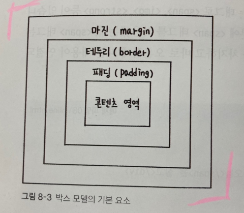
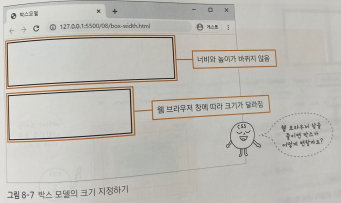
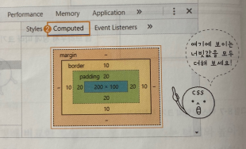

***
## CSS와 박스 모델

CSS 박스 모델이란 웹 문서의 내용을 박스 형태로 정의하는 방법이다.

이 박스 모델이 모여 웹 문서를 이루는 것이다.

박스 모델에는 마진과 패딩, 테두리 등 박스가 여러 겹 들어 있다.

***
### 블록 레벨 요소와 인라인 레벨 요소

박스 모델은 블록 레벨 요소인지 인라인 레벨 요소인지에 따라 나열 방법이 달라진다.

 

### 블록 레벨 요소란 

태그를 사용해 요소를 삽입했을 때 혼자 한 줄을 차지하는 것을 가리킨다.

한 줄을 차지한다는 것은 해당 요소의 너비가 100%라는 뜻이다.

따라서 블록 레벨 요소의 왼쪽이나 오른쪽에 다른 요소가 올 수 없다.

대표적인 태그로 h1, div, p등이 있다.

 

### 인라인 레벨 요소란

콘텐츠 만큼만 영역을 차지하고 나머지 공간에는 다른 요소가 올 수 있다.

따라서 한 줄에 인라인 레벨 요소를 여러 개 표시할 수 있다.

인라인 레벨 요소를 만드는 태그로는 span, img, strong등이 있다.
***

### 박스 모델의 기본 구성

블록 레벨과 인라인 레벨 두 요소는 모두 박스 형태이다.

스타일 시트에서는 이렇게 박스 형태인 요소를 박스 모델 요소라고 한다.

웹 문서 안에서 여러 요소를 원하는 위치에 배치하려면 CSS 박스 모델을 잘 알고 있어야 한다.

그래야 한 줄에 배치할지, 줄을 바꾸어 배치할지, 요소와 요소 사이의 간격을 어떻게 조절할지 결정할 수 있다.

 

박스 모델은 콘텐츠 영역, 박스와 콘텐츠 영역 사의 여백인 패딩, 박스의 테두리, 그리고 여러 박스 모델 사이의 여백인 마진 등의 요소로 구성된다.

이때 마진이나 패딩은 웹 문서에서 다른 콘텐ㅊ 사이의 간격이나 배치 등을 고려할 때 필요한 개념이다.

***

### 콘텐츠 영역의 크기를 지정하는 width, height 속성

박스 모델에서 콘텐츠 영역의 크기를 지정할 때 너비는 width, 높이는 height속성을 사용한다.

width, height속성에서 사용할 수 있는 값은 다음과 같다.

|종류|설명|
|----|----|
|크기|너비나 높이의 값을 px이나 em단위로 지정한다.|
|백분율|박스 모델을 포함하는 부모 요소를 기준으로 너빗값이나 높잇값을 백분율로 지정한다.|
|auto|박스 모델의 너빗값과 높잇값이 콘텐츠 양에 따라 자동으로 결정된다. 기본값|

***

### 박스 모델의 크기를 계산하는 box-sizing속성

width속성과 height속성은 박스 모델에서 콘텐츠 주변의 여백이나 테두리를 뺀 콘텐츠 영역의 크기를 가리킨다.

그래서 웹 문서에 여러 가지 요소를 배치할 때 실제 박스 모델이 차지하는 크기는 콘텐츠 영역 외에도 콘텐츠와 테두리 사이의 여백, 테두리 두께까지 계산해야 한다.

box-sizing은 박스 모델의 너비와 높이를 어떻게 결정할 것인지에 따라 border-box와 content-box 둘 중에서 선택할 수 있다.

|종류|설명|
|----|----|
|border-box|테두리까지 포함해서 너빗값을 지정한다.|
|content-box|콘텐츠 영역만 너빗값을 지정한다. 기본값|

웹 문서 레이아웃을 만들 때는 CSS에서 박스 모델을 사용하는데, 요소의 크기를 쉡게 계산하려면 box-sizing속성을 border-box로 지정해 놓는 것이 좋다.

***
### 박스 모델에 그림자 효과를 주는 box-shadow속성

CSS에서는 box-shadow속성을 사용하면 포토샵 같은 프로그램을 따로 사용하지 않고도 그림자 효과를 줄 수 있다.

그림자는 이미지 또는 div와 같이 전체 영역에 지정하여 넣을 수 있는데, box-shadow에서 그림자 위치나 색상, 흐림 정도 등을 지정하려면 다음과 같은 형식으로 사용한다.

    - 기본형
    box-shadow: <수평 거리> <수직 거리> <흐림 정도> <번짐 정도> <색상> inset

<b>box-shadow의 속성값에서 수평 거리와 수직 거리는 반드시 지정해야 한다.</b>

그림자의 위치는 수평 거리와 수직 거리의 값에 따라 움직인다.

수평 거리와 수직 거리 이외의 속성값은 옵션이므로 필요할 때만 사용하면 된다.

|종류|설명|
|----|----|
|수평 거리|그림자가 가로로 얼마나 떨어져 있는지를 나타낸다. 양숫값은 요소의 오른쪽에, 음숫값은 요소의 왼쪽에 그림자를 만든다. 필수 속성이다.|
|수직 거리|그림자가 세로로 얼마나 떨어져 있는지를 나타낸다. 양숫값은 요소의 아래쪽에, 음숫값은 요소의 위쪽에 그림자를 만든다. 필수 속성이다.|
|흐림 정도|이 값을 생략하면 0을 기본값으로 하여 진한 그림자를 표시한다. 이 값이 커질수록 부드러운 그림자를 표시하며, 음숫값은 사용할 수 없다.|
|번짐 정도|양숫값을 사용하면 모든 방향으로 그림자가 퍼져서 박스보다 그림자가 크게 표시된다. 반대로 음숫값은 모든 방향으로 그림자가 축소되어 보인다. 기본값은 0이다.|
|색상|한 가지만 지정할 수도 있고, 공백으로 구분해서 여러 개의 색상을 지정할 수도 있다. 기본값은 현재 검은색이다.|
|inset|이 키워드를 함께 표시하면 안쪽 그림자로 그린다.|

