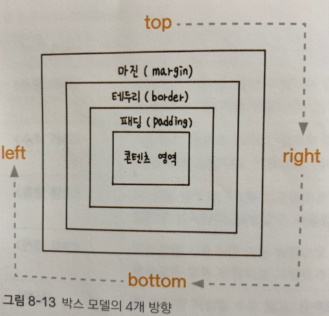

***
## 테두리 스타일 지정하기
 

박스 모델을 사용해 웹 문서에 요소를 배치하려면 각 박스 모델의 크기와 여백, 테두리 스타일 등을 고려해야 한다.

***

### 박스 모델의 방향 

 

박스 모델은 상하좌우 4개의 방향이 있어서 

테두리나 마진, 패딩 등을 지정할 때 

한꺼번에 똑같이 지정하거나, 모두 다르게 지정할 수도 있다.

이때 박스 모델의 4개 방향을 가리키는 예약어를 미리 알아 두는 것이 좋다.

박스 모델의 방향으로 맨 윗부분은 top, 오른쪽은 right, 아랜부분은 bottom, 그리고 왼쪽은 left라고 한다.

맨 위부터 시작해서 top -> right -> bottom -> left 처럼 시계 방향으로 순서를 기억해 두자.

***

### 테두리 스타일을 지정하는 border-style속성

 

테두리 스타일을 지정하는 border-style속성의 기본값은 none이므로 속성값을 따로 지정하지 않으면 테두리 색상이나 
두께를 지정하더라도 화면에 표시되지 않는다.

따라서 테두리를 그리려면 가장 먼저 테두리 스타일의 속성값을 지정해야 한다.

|종류|설명|
|----|----|
|none|테두리가 없다. 기본값|
|hidden|테두리를 감춘다. 표에서 border-collapse: collapse일 경우 다른 테두리도 표시되지 않는다.|
|solid|테두리를 실선을 로표시한다.|
|dotted|테두리를 점선으로 표시한다.|
|dashed|테두리를 짧은 직선으로 표시한다.|
|double|테두리를 이중선으로 표시한다. 두 선 사이의 간격이 border-width값이 된다.|
|groove|테두리를 창에 조각한 것처럼 표시한다. 홈이 파인 듯 입체 느낌이 난다.|
|inset|표에서 border-collapse: seperate일 경우 전체 박스 테두리가 창에 박혀 있는 것처럼 표시되고, 표에서 border-collapse: collapse일 경우 groove와 똑같이 표시된다.|
|outset|표에서 border-collapse: seperate일 경우 전체 박스 테두리가 창에서 튀어나온 것처럼 표시되고, 표에서 border-collapse: collapse일 경우 ridge와 똑같이 표시된다.|
|ridge|테두리를 창에서 튀어나온 것처럼 표시한다.|
***

만약 테두리 스타일을 4개 방향 모두 다르게 지정하고 싶다면 border-top-style처럼 border와 style사이에 상하좌우 방향을 넣고 하이픈으로 연결한다.

***

### 테두리 두께를 지정하는 border-width속성

 

테두리 스타일과 마찬가지로 두께가 있어야만 화면에 테두리가 나타난다.

border-width속성의 이름에서 알 수 있듯이 이 속성을 이용하면 테두리 두께를 지정할 수 있다.

테두리 두께를 지정할 때는 1px나 5px처럼 크기를 직접 입력 할 수도 있고 thin이나 medium, thick같은 예약어 중에서 선택할 수도 있다.

    - 기본형
    border-width: <크기> | thin | medium | thick

만일 테두리 두께를 4개 방향 모두 다르게 지정하고 싶다면 border-top-width처럼 border와 width사이에 상하좌우 방향을 넣고 하이픈으로 연결한다.

border-width속성을 사용해서 상하좌우 4개 방향의 테두리 스타일을 한꺼번에 지정할 수 있는데, 이때 값을 1개만 지정할 수도 있고 2개나 3개, 또는 4개를 각각 다르게 지정할 수도 있다.

1) 첫 번째 박스 스타일에는 border-width 속성값이 1개이다. 이 경우에는 4개 방향 테두리 모두 같은 값이 적용된다.

        #box1 { border-width: 2px; }

2) 두 번째 박스 스타일처럼 속성값이 2개라면 첫 번째 값이 thick이 위아래(top, bottom) 테두리의 값이 되고, 두 번째 값 thin은 좌우 (left, right) 테두리의 값이 적용된다.

        #box2 { border-width: thick thin; }

3) 세 번째 박스 스타일은 속성값이 3개이다. 순서대로 top -> right -> bottom의 속성값인데 마지막 left 속성값이 빠져 있다. 이때 left 속성값은 마주 보는 right 속성값과 똑같이 적용된다.

        #box3 { border-width: thick thin thin; }

4) 네 번째 박스 스타일은 border-width 속성값 4개를 각각 다르게 지정했다. top -> right -> bottom -> left 순으로 적용한다.

        #box4 { border-width: 10px 5px 5px 10px; }

***

### 테두리 스타일 묶어 지정하는 border속성

 

테두리 스타일과 두께, 색상 등의 속성을 각각 따로 사용하게되면 테두리와 관련된 스타일 소스만 해도 아주 길어진다.

그래서 테두리 스타일과 두께, 색상을 한꺼번에 표현한다.

4개 방향의 테두리 스타일을 다르게 지정하고 싶다면 

border-top이나 border-right처럼 속성 이름에 방향을 함께 써서 따로 지정할 수도 있고, 

4개 방향의 테두리 스타일이 같다면 간단히 border속성만 사용하면 된다.

이때 테두리의 두께와 색상, 스타일의 속성값 순서는 상관없다.

***

### 둥근 테두리를 만드는 border-radius속성

 

박스 모델에서 테두리를 표시하면 기본적으로 사각형에 네 군데 꼭짓점이 직각이다.

border-radius속성을 사용하면 꼭짓점 부분에 원이 있다고 가정해서 둥글게 처리한다.

이때 원의 반지름을 이용하면 둥근 정도를 나타낼 수 있다.

    - 기본형
    border-radius: <크기> | <백분율>

|종류|설명|
|----|----|
|크기|반지름 크기를 px, em의 단위와 함께 수치로 표시한다.|
|백분율|현재 요소의 크기를 기준으로 비율 %로 지정한다.|

 

border-radius속성을 사용하여 이미지를 원 형태로 만들 수 있다.

이미지 요소의 너비와 높이를 똑같이 만든 후 border-radius의 반지름값을 너비나 높이의 50%로 지정하면 원이 된다.

***

### 꼭짓점마다 따로 둥글게 처리하기

 

박스 모델에서 꼭짓점 4개를 모두 다르게 지정하고 싶다면 border와 radius 사이에 위치를 나타내는 예약어를 넣어 사용한다.

***

border-radius속성을 사용해서 꼭짓점을 타원 형태로 만들 수도 있다.

이 경우에는 꼭짓점에 원 대신 타원이 있다고 생각하면 된다.

반지름 대신 타원의 가로 반지름값과 세로 반지름값을 넣어주는데, 가로 반지름과 세로 반지름 사이에 슬래시 / 를 넣어서 구분한다.

    border-radius: <가로 반지름> / <세로 반지름>;

그리고 특정한 꼭짓점만 타원 형태로 만들겠다면 슬래시 없이 가로 반지름과 세로 반지름을 지정한다.

    border-위치-radius: <가로 반지름> <세로 반지름>;

