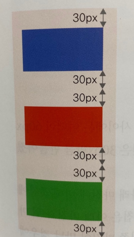
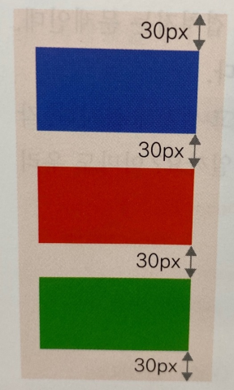
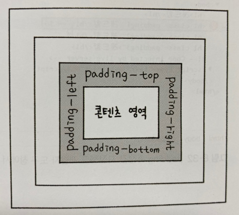

***
## 여백을 조절하는 속성
***

### 요소 주변의 여백을 설정하는 margin속성

 

margin은 요소 주변의 여백을 의미한다.

따라서 마진을 이용하면 요소와 요소 사이의 간격을 조절할 수 있다.

앞서 배운 속성들과 마찬가지로 마진도 박스 모델의 4개 방향에 한번에 똑같이 지정할 수도 있고,

margin 다음에 하이픈을 넣고 위치를 나타내는 예약어 top, right, bottom, left를 사용해서 특정 방향에만 지정할 수도 있다.

    - 기본형
    margin: <크기> | <백분율> | auto

margin 속성에서도 속성값을 하나만 지정하거나 2개, 3개 또는 4개를 지정할 수 있다.

값이 1개라면 마진값을 4개 방향 모두 똑같이 지정하지만, 값이 여러 개라면 

top -> right -> bottom -> left순(시계방향)으로 적용된다는 것을 기억하자

|종류|설명|
|----|----|
|크기|너빗값이나 높잇값을 xp이나 em 같은 단위와 함께 수치로 지정한다.|
|백분율|박스 모델을 포함한 부모 요소를 기준으로 너빗값이나 높잇값을 퍼센트로 지정한다.|
|auto|display 속성에서 지정한 값에 맞게 적절한 값을 자동으로 지정한다.|

***

### 마진 속성을 사용하여 웹 문서를 가운데 정렬하기

 

웹 문서에서 텍스트 요소를 배치할 때는 text-align속성을 사용해서 정렬했다.

하지만 웹 문서 전체를 화면 중앙에 배치하려면 margin속성을 사용하는 것이 바람직하다.

margin속성을 사용해 웹 문서의 내용을 화면 중앙에 배치하려면 우선적으로 배치할 요소의 너빗값이 정해져 있어야 한다.

그리고 margin-left와 margin-right의 속성값을 auto로 지정한다.

이렇게 지정하면 CSS는 웹 브라우저 화면의 너비에서 요소 너빗값을 뺀 나머지 영역을 좌우 마진으로 자동 계산한다.

***

### 마진 중첩 이해하기

 

박스 모델에서 마진을 지정할 때 주의해야 할 것이 있다.

그것은 바로 요소를 세로로 배치할 경우에 각 요소의 마진과 마진이 서로 만나면 마진값이 큰 쪽으로 겹쳐지는 문제인데,

이런 현상을 마진 <b>중첩(margin overlap)</b>또는 <b>마진 상쇄(margin collapse)</b>라고 한다.

예를 들어 보자

div태그를 사용한 박스 영역 3개가 있다고 생각해 보자.

각 박스 영역의 margin속성값을 30px로 지정했다면 아마도 우리가 예상하는 모습은 다음 그림과 같은 형태일 것이다.

하지만 실제로 소스를 작성하고 웹 브라우저에서 확인하면 예상한 것과 다른 결과가 나타난다.

첫 번째 박스와 두 번째 박스 사이 그리고 두 번째 박스와 세 번째 박스 사이에는 여백이 60px만큼 생길 것으로 예상했지만

실제로는 30px 2개가 겹쳐서 최종 마진은 30px만큼 만들어졌다.

이렇게 된 이유는 여러 요소를 세로로 배치할 때 맨 위의 마진과 맨 아래 마진에 비해 

중간에 있는 마진이 지나치게 커지는 것을 방지하기 위한 것이다.

마진 중첩은 아래 마진과 위 마진이 서로 만날 때 큰 마진값으로 합쳐지는 것이고, 

오른쪽 마진과 왼쪽 마진이 만날 경우에는 중첩되지 않는다.

***

### 콘텐츠와 테두리 사이의 여백을 설정하는 padding속성

 

패딩이란 콘텐츠 영역과 테두리 사이의 여백을 말한다.

다시 말해 테두리 안쪽의 여백이라고 생각하면 된다.

패딩과 마진은 여백이 어느 위치에 있느냐만 다를 뿐 박스 모델에서 패딩을 지정하는 방법은 마진과 거의 같다.

패딩도 마찬가지로 padding속성으로 4개 방향의 마진을 한꺼번에 지정할 수도 있고, 

padding 다음에 하이픈을 넣고 위치를 나타내는 예약어 

top, right, bottom, left를 사용해서 특정 방향에만 지정할 수도 있다.

