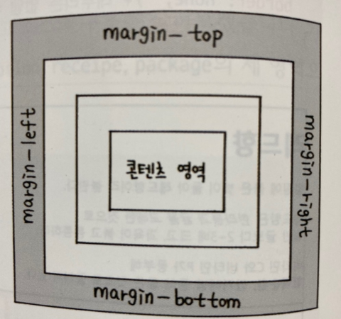

***
## 여백을 조절하는 속성
***

### 요소 주변의 여백을 설정하는 margin속성

 

margin은 요소 주변의 여백을 의미한다.

따라서 마진을 이용하면 요소와 요소 사이의 간격을 조절할 수 있다.

앞서 배운 속성들과 마찬가지로 마진도 박스 모델의 4개 방향에 한번에 똑같이 지정할 수도 있고,

margin 다음에 하이픈을 넣고 위치를 나타내는 예약어 top, right, bottom, left를 사용해서 특정 방향에만 지정할 수도 있다.

    - 기본형
    margin: <크기> | <백분율> | auto

