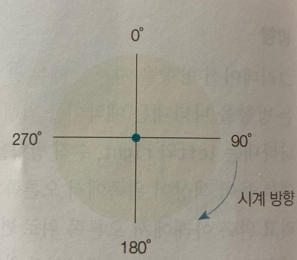

***
## 그라데이션 효과로 배경 꾸미기

 

웹 문서의 배경을 꾸밀 때는 배경색이나 이미지를 사용하는 것 외에 그라데이션 효과로 색 다른 느낌을 줄 수도 있다.

그라데이션 효과를 사용하려면 아직 웹 브라우저의 다양한 부분을 고려해야 하지만 여러모로 편리하게 사용할 수 있는 기능이다.

***
### 선형 그라데이션

선형 그라데이션이란 색상이 수직, 수평 또는 대각선 방향으로 일정하게 변하는 것을 말한다.

이것을 만들어 주는 함수는 linear-gradient인데 색상이 어느 방향으로 바뀌는지 그리고 어떤 색상으로 바뀌는지 알려 주어야 한다.

    - 기본형
    linear-grdient(to <방향> 또는 <각도>, <색상 중지점>, [<색상 중지점>, ...]);

 

- 방향
    
    그라데이션 방향을 지시할 때는 끝 지점을 기준으로 to 예약어와 함께 사용한다.

    to 다음에는 방향을 나타내는 예약어를 최대 2개까지 사용할 수 있다.

    이때 예약어는 수평 방향을 나타내는 left와 right, 수직 방향을 나타내는 top과 bottom을 사용한다.

    예를 들어 색상이 왼쪽에서 오른쪽으로 변하는 그라데이션이라면 to right로 사용한다.

    그리고 왼쪽 아래에서 오른쪽 위로 변하는 그라데이션이라면 to right top또는 to top right로 사용한다.

    선형 그라데이션의 위치나 각도 옵션을 생략하면 to bottom으로 인식한다.

- 각도

    각도는 선형 그라데이션에서 색상이 바뀌는 방향을 알려 주는 방법이다.

    이때 각도는 그라데이션이 끝나는 부분이고 값은 deg로 표기한다.

    다음 그림과 같이 CSS에서 각도는 맨 윗부분이 0deg이고, 시계 방향으로 회전하면서 90deg, 180deg가 된다.

    

- 색상 중지점

    2가지 색이상의 선형 그라데이션을 만들려면 색상이 바뀌는 부분을 지정해 주어야 한다.

    그라데이션에서 바뀌는 색을 색상 중지점이라고 한다.

    색상 중지점을 지정할 때 쉼표(,)로 색상을 구분하는데, 색상만 지정할 수도 있고 색상과 함께 중지점의 위치도 함께 지정할 수 있다.

    투명도를 함께 사용한 색상도 rgba 표기법을 이용해서 색상 중지점을 지정할 수 있다.