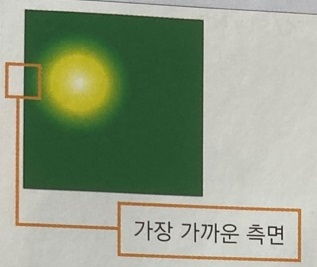
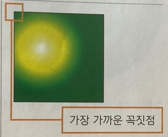
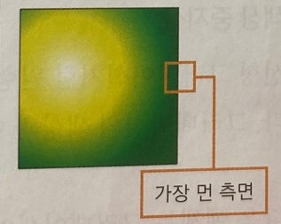
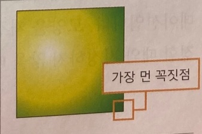

***
### 원형 그라데이션

 

선형 그라데이션이 직선 형태로 색상이 바뀌는 거라면, 윈형 그라데이션은 원 또는 타원의 중심에서부터 동심원을 그리며 바깥 방향으로 색상이 바뀐다.

따라서 원형 그라데이션은 색상이 바뀌기 시작하는 원의 중심과 크기를 지정하고 그라데이션의 모양을 선택한다.

    - 기본형
    radial-grdient(<모양> <크기> at <위치>, <색상 중지점>, [<생상 중지점>, ...])

- 모양 

    원형 그라데이션에서 만들어지는 모양은 원형(circle)과 타원형(ellipse)이다.

    모양을 따로 지정하지 않으면 타원형으로 인식한다.

- 크기

    원형 그라데이션을 지정할 때 원의 크기도 정할 수 있다.

    원의 모양(circle 또는 ellipse)과 크기를 나타내는 키워드값을 함께 쓰면 되는데, 크기에서 사용할 수 있는 값은 다음과 같다.

 

|속성값|설명|결과 화면|
|------|----|---------|
|closest-side|원형이라면 그라데이션 가장자리가 그라데이션 중심에서 가장 가까운 요소의 측명에 닿을 때까지 그린다. 타원형이라면 그라데이션 중심에서 가장 가까운 요소의 가로 측면이나 세로 측면에 닿을 때까지 그린다. 결과 화면은 그라데이션을 적용하는 요소가 변이 4개인 사각형이다. 여기에서는 오른쪽 측면에 그라데이션의 가장 자리가 닿을 때까지 그라데이션을 그린다.||
|closest-corner|그라데이션 가장자리가 중심에서 가장 가까운 요소의 코너에 닿도록 그린다. 결과 화면은 그라데이션이 저굥ㅇ되는 사각형 요소에 꼭짓점(corner)이 4개 있는데, 그라데이션의 중심에서 가장 가까운 꼭짓점에 닿을 때까지 그라데이션을 그린다.||
|farthest-side|원형이라면 그라데이션 가장자리가 그라데이션 중심에서 가장 멀리 떨어져 있는 측면에 닿을 때까지 그린다. 타원형이라면 그라데이션 가장자리가 그라데이션 중심에서 가장 멀리 떨어져 있느 가로 또는 세로 측면과 만나도록 한다.||
|farthest-corner|그라데이션의 가장자리가 그라데이션의 중심에서 가장 멀리 떨어져 있는 코너에 닿도록 한다. 기본값||

 

- 위치

    at 키워드와 함께 지정하면 그라데이션이 시작하는 원의 중심을 다르게 나타낼 수 있다.

    사용할 수 있는 위치 속성값은 키워드(left, center, right 중 하나 또는 top, center, bottom 중 하나) 또는 30%, 20$ 같은 백분율이다.

    속성값을 생략하면 가로와 세로 모두 중앙인 center로 인식한다.

- 색상 중지점

    선형 그라데이션처럼 원형 그라데이션에서도 색상이 바뀌는 부분을 색상 중지점이라고 한다.

    그라데이션의 색상과 어느 부분에서 색상을 바꿀지 위치도 함께 지정할 수 있다.

