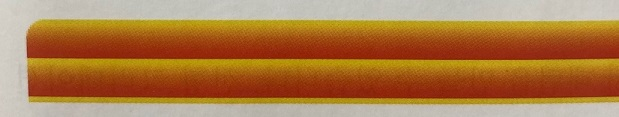
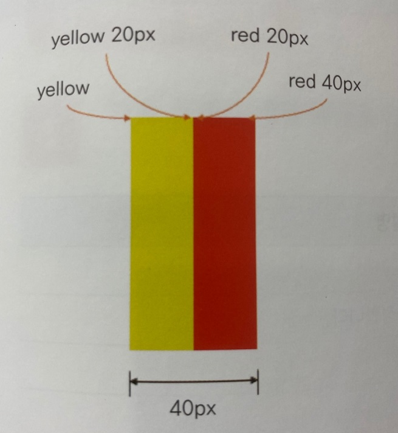

***
### 그라데이션을 사용한 패턴 만들기

 

선형 그라데이션과 원형 그라데이션은 반복해서 패턴을 만들 수 있다.

선형 그라데이션을 반복할 때는 repeating-linear-grdient를 사용하고, 원형 그라데이션을 반복할 때는 repeating-radial-grdient를 사용한다.

그런데 이렇게 선형 그라데이션을 반복하면 그라데이션끼리 만나는 부분이 자연스럽지가 않다.

그림과 같이 'yellow, red 20px' 옵션을 사용하므로 노란색부터 빨간색까지 부드럽게 섞여 표시되지만, 다음 노란색이 시작되는 부분에서는 이전 빨간색과 노란색이 겹쳐 주황색처럼 표시된다.

그래서 그라데이션을 반복해서 패턴을 만들 때는 각 색상 중지점의 위치를 적절하게 조절해야 한다.

선형 그라데이션을 반복할 때는 다음 그림과 같이 시작 색상과 끝 색상을 명확히 구분해 줘야 중간에 섞이지 않는다.

원형 그라데이션의 경우에도 같은 방법으로 반복하는 패턴을 만들 수 있다.

