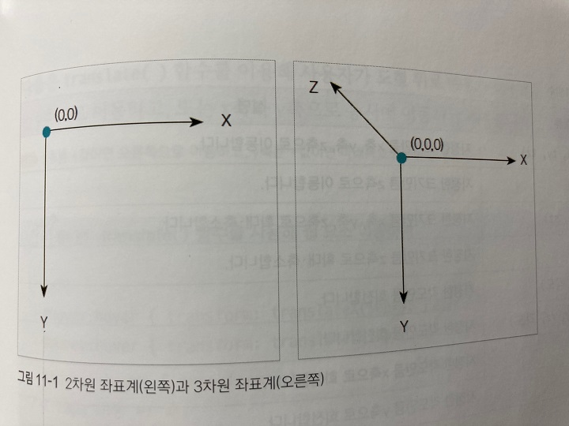

## 트랜지션과 애니메이션

 

애니메이션 동작을 알면 웹 사이트의 메뉴를 부드럽게 열 수 있고, 웹 요소를 이동할 수도 있다.

예전에는 이런 기능을 자바스크립트로 처리 했지만 이제는 CSS만으로도 얼마든지 가능하다.

***
## 변형 알아보기

 

일반적으로 물체의 크기나 형태의 위치를 바꾸는 것을 변형, 또는 트랜스폼이라고 한다.

웹 문서에서 CSS변형을 이용하면 사용자의 동작에 바능ㅇ해 텍스트나 이미지 등을 움직이게 할 수 있다.

이런 변형을 이용하면 사용자가 웹 요소를 좀 더 흥미롭게 느낄 수 있다.

***
### transform과 변형 함수

 

CSS에서 변형을 적용하려면 transform 속성과 변형 함수 이름을 함께 작성해야 한다.

    - 기본형 transform: 함수

웹 요소를 이동시키는 변형 함수는 translate()인데, 

예를 들어 웹 요소를 x축으로 50px, y축으로 100px 이동하는 클래스 선택자 .photo를 정의하려면 다음과 같이 사용한다.

    .photo { transform: translate(50px, 100px) }

 

- 2차원 변형과 3차원 변형

    2차원 변형은 웹 요소를 평면에서 변형한다. 수평 방향으로 이동하거나 수직 방향으로 왜곡한다.

    이렇게 평면에서 변형할 때는 2차원 좌표를 사용하는데, x축은 오른쪽으로 갈수록 값이 커지고 y축은 아래로 내려갈수록 값이 커진다.

    반면에 3차원 변형은 x축과 y축에 원근감을 주는 z축을 추가해서 변형한다. 

    3차원 변형에서 z축은 앞뒤로 이동하며, 보는 사람 쪽으로 다가올수록 값이 커지고 뒤로 갈수록 값이 작아진다.

 

***
- 2차원 변형 함수

    |종류|설명|
    |----|----|
    |translate(tx, ty)|지정한 크기만큼 x축, y축으로 이동한다.|
    |translateX(tx)|지정한 크기만큼 x축으로 이동한다.|
    |translateY(ty)|지정한 크기만큼 y축으로 이동한다.|
    |scale(sx, sy)|지정한 크기만큼 x축, y축으로 축소한다.|
    |scaleX(sx)|지정한 크기만큼 x축으로 축소한다.|
    |scaleY(sy)|지정한 크기만큼 y축으로 축소한다.|
    |rotate(각도)|지정한 각도만큼 회전한다.|
    |skew(ax, ay)|지정한 각도만큼 x축, y축으로 왜곡한다.|
    |skew(ax)|지정한 각도만큼 x축으로 왜곡한다.|
    |skew(ay)|지정한 각도만큼 y축으로 왜곡한다.|

 

- 3차원 변형 함수

    2차원 변형 함수에 z축을 추가하면 3차원 변형 함수가 된다.

    |종류|설명|
    |----|----|
    |translate3d(tx, ty, tz)|지정한 크기만큼 x축, y축, z축으로 이동한다.|
    |translateZ(tz)|지정한 크기만큼 z축으로 이동한다.|
    |scale3d(sx, sy, sz)|지정한 크기만큼 x축, y축, z축으로 확대,축소한다.|
    |scaleZ(sz)|지정한 크기만큼 z축으로 확대,축소한다.|
    |rotate(rx, ry, 각도)|지정한 각도만큼 회전한다.|
    |rotate(rx, ry, rz, 각도)|지정한 각도만큼 회전한다.|
    |rotateX(각도)|지정한 각도만큼 x축으로 회전한다.|
    |rotateY(각도)|지정한 각도만큼 y축으로 회전한다.|
    |rotateZ(각도)|지정한 각도만큼 z축으로 회전한다.|
    |perspective(길이)|입체적으로 보일 수 있도록 깊잇값을 지정한다.|
