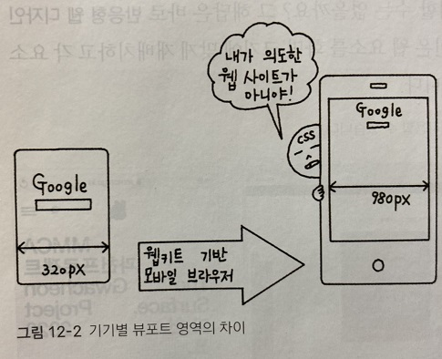

## 반응형 웹과 미디어 쿼리

 

반응형 웹 디자인은 PC 브라우저이든 모바일 브라우저이든 사용자의 접속 환경에 맞추어 사이트의 레이아웃을 자연스럽게 바꾸어 보여 주는 것을 말한다.

사이트를 하나 제작해 여러 기기에서 볼 수 있도록 하는 것이다.

반응형 웹 디자인이란 무엇인지 알아보고, 반응형 웹 사이트를 만드는 기본 개념인 미디어 쿼리와 다양한 그리드 레이아웃을 살펴보자.

***
## 반응형 웹 알아보기

 

화면 크기가 다양한 모바일이 계속 쏟아져 나오는데 그때마다 사이트를 따로따로 제작하는 것은 매우 비효율적이다.

이런 점을 고려해서 화면 크기에 '반응'하는 화면 요소를 자동으로 바꾸어 사이트를 구현하는 것이 바로 반응형 웹 디자인이다.

***
### 반응형 웹 디자인이란

 

반응형 웹 디자인을 웹 요소를 화면 크기에 맞게 재배치하고 각 요소의 표시 방법만 바꾸어 사이트를 구현해 준다.

CCS3을 지원하는 모던 브라우저에서만 사용할 수 있다.

***
### 모바일 기기를 위한 뷰포트

 

반응형 웹 디자인에서 기본적으로 알아 두어야 할 것이 뷰포트(viewport)이다. 

PC에 맞게 제작한 웹 사이트를 모바일 기기에서 접속해서 보면 모든 내용이 작게 표시되는데, 

그 이유는 PC화면과 모바일 화면에서 표시되는 픽셀의 차이 때문이다.

뷰포트를 지정하면 접속한 기기의 화면에 맞추어 확대하거나 축소해서 표시할 수 있다.

뷰포트란 이때 스마트폰 화면에서 실제 내용이 표시되는 영역이다.

***
### 웹키트(webkit)

PC화면에 맞춰서 제작한 사이트를 모바일 기기에서 확인하면 원래 PC화면 크기 만큼 표시하므로 글자가 아주 작다.

또한 모바일 기기에 적합한 사이트를 제작했더라도 정작 스마트폰 화면에서 내용을 확인하면 원래 의도한 대로 표시되지 않기도 한다.

이것은 웹키트를 기반으로 한 모바일 브라우저의 기본 뷰포트 너비가 980px이기 때문이다.

다시 말해 웹 페이지 너비를 스마트폰용인 320px로 맞추어 웹 사이트를 제작하더라도 스마트폰용 모바일 브라우저의 기본 뷰포트 너비가 980px이므로 웹 페이지 너비를 무조건 980px로 표시하려고 한다.

결국 스마트폰용으로 제작한 웹 페이지의 내용은 의도와 달리 작은 글로 표시되버린다.

그러므로 모바일 기기에 적합한 사이트를 제작하려면 뷰포트 개념을 꼭 알아야 한다.

웹 키트를 기반으로 한 브라우저(webkit-based browser)란 브라우저를 동작시키는 실행 엔진이 웹키트 엔진이라서 붙은 이름이다.

PC용 크롬, 엣지, 사파리 브라우저를 비롯해 대부분의 모바일 브라우저는 웹키트 엔진을 기반으로 한다.

