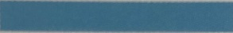
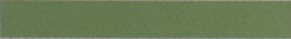
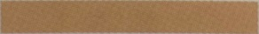

***
### 미디어 쿼리의 중단점

 

미디어 쿼리를 작성할 때 화면 크기에 따라 서로 다른 CSS를 적용할 분기점을 중단점(break point)라고 한다.

이 중단점을 어떻게 지정하느냐에 따라 CSS가 달라지고 화면 레이아웃이 바뀌는데,

대부분 기기의 화면 크기를 기준으로 한다.

하지만 기중에 나온 모든 기기를 반영 할 수는 없으므로 모바일과 태블릿, 테스크톱 정도로만 구분하는 것이 좋다.

그리고 처리 속도나 화면 크기 등에서 다른 기기보다 모바일의 제약 조건이 더 많으므로 모바일의 레이아웃을 기본으로 하여 CSS를 만든다.

모바일용 CSS는 태블릿과 데스크톱에도 기본으로 적용된다.

그러고 나서 사양이 좀 더 좋고 화면이 큰 태블릿과 데스크톱에 맞춰 더 많은 기능과 스타일을 추가한다.

이렇게 모바일을 먼저 고려하여 미디어 쿼리를 작성하는 것을 모바일 퍼스트 기법이라고 한다.

미디어 쿼리를 작설할 때 주어진 조건에 따라 여러 중단점을 만들 수 있지만 크게 다음과 같이 모바일, 태블릿, 데스크톱으로 구분한다.

하지만 이 중단점 역시 개발자나 작업 조건에 따라 달라질 수 있다.

    - 스마트폰: 모바일 페이지는 미디어 쿼리를 사용하지 않고 기본 CSS로 작성한다. 만일 스마트폰의 방향까지 고려해서 제작한다면 min-width의 세로와 가로를 각각 portrait 320px, landscape 480px로 지정한다.
    - 태블릿: 세로 크기가 768px 이상이면 태블릿으로 지정한다. 가로 크기는 데스크톱과 똑같이 1024px 이상으로 지정한다.
    - 데스크톱: 화면 크기가 1024px 이상이면 데스크톱으로 설정한다.

    ! 새로운 모바일 기기가 계속해서 등장하는데 모든 기기의 해상도와 뷰포트 크깃값을 다 기억할 수는 없다.
    ! 특정한 기기에 맞는 미디어 쿼리를 작성하는 데 필요한 뷰포트 크깃값이 정리되어 있는 사이트가 있다.
    ! yesviz.com/devices.php 에 접속해 보자
    ! 이 사이트에 접속한 뒤 목록에서 기기를 선택하면 화면 크기뿐만 아니라 뷰포트 크기 등 미디어 쿼리를 작성하는 데 필요한 정보를 확인할 수 있다.
    ! 그리고 여러 상황에 맞는 미디어 쿼리 소스도 제공하므로 참고할 수 있다.

***
### 미디어 쿼리 막대의 색상의 의미

 

사용한 미디어 쿼리 조건에 따라 미디어 쿼리 막대가 1개인 곳도 있고, 2개나 3개인 곳도 있다.

막대 색상마다 다음과 같은 의미가 있다.

|종류|설명|
|----|----|
||최대 너비(max-width)를 기준으로 중단점을 나눈 미디어 쿼리 문이다.|
||최소 너비와 최대 너비를 이용해 특정 범위를 기준으로 중단점을 나눈 미디어 쿼리 문이다.|
||최소 너비(min-width)를 기준으로 중단점을 나눈 미디어 쿼리 문이다.|

3가지 막대 위로 마우스 포인터를 올리면 적용된 미디어 쿼리 소스도 각각 확인할 수 있다.

