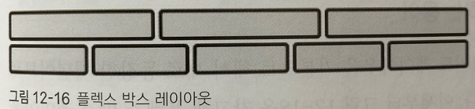
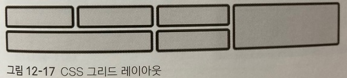

## 그리드 레이아웃 알아보기

웹 사이트의 레이아웃을 정할 때 사이트 전체 디자인이나 일관성을 유지하려면 그리드 레이아웃을 사용해야 한다.

그리드 레이아웃을 만드는 방법으로 플렉서블 박스 레이아웃과 CSS 그리드 레이아웃이 있다.

***
### 그리드 레이아웃이란

 

반응형 웹 디자인을 사용한 사이트는 화면 너비에 따라 웹 문서의 요소를 재배치해야 한다.

재배치하려면 기준이 되는 레이아웃이 필요한데 이때 그리드 레이아웃을 사용한다.

그리드 레이아웃이란 웹 사이트를 여러 개의 칼럽(column)으로 나눈 후 메뉴나 본문, 이미지 등의 웹 요소를 화면에 맞게 배치하는 것을 말한다.

그리드 레이아웃을 사용하면 화면을 규칙적으로 배열하므로 레이아웃을 일관성 있게 유지할 수 있다.

그리드 레아웃의 3가지 특징을 살펴보자.

 

- 시각적으로 안정된 디자인을 만들 수 있다.
    
    그리드 레이아웃을 사용한 웹 사이트 디자인을 사용자에게 안정감을 준다.

    이미 책이나 신문 등 여러 시작 매체에서는 대부분 그리드 레이아웃을 사용하고 있다.

    그러므로 우리의 눈은 한 화면을 여러 개의 칼럽으로 구성해서 밑으로 늘어뜨리는 그리드 레이아웃에 익숙하다.

 

- 업데이트가 편한 웹 디자인을 구성할 수 있다.

    그리드 레이아웃을 이용하면 실제 내용을 넣지 않은 상태에서도 사이트 레이아웃을 미리 만들어 볼 수 있다.

    사이트나 콘텐츠 영역의 너비, 각 요소의 위치 등 사이트 구조를 먼저 만들어 놓고 나중에 내용을 채워 넣을 수 있다.

    이렇게 사이트를 만들면 나중에 내용을 업데이트하기도 쉽다.

 

- 요소를 자유롭게 배치할 수 있다.

    우리가 잘 알고 있는 div나 p같은 블록 레벨 요소는 한 줄에 하나의 요소만 배치할 수 있다.

    그리드 레이아웃을 사용하지 않는다면 말이다.

    따라서 그리드 레이아웃을 사용하지 않는 웹 사이트에서는 원하는 내용을 찾기가 매우 불편할 것이다.

    하지만 그리드 레이아웃을 사용하면 한 줄에 여러 요소를 배치할 수도 있고, 중요한 내용은 좀더 넓은 공간에 두어 사용자에게 잘 보이게 할 수도 있다.

***
### 그리드 레이아웃을 만드는 방법

 

반응형 웹 디자인에 적합한 그리드 레이아웃을 만드는 방법은 여러 가지가 있다.

기존에 알고 있던 가번 그리드를 CSS의 float 속성으로 사용할 수도 있고, 플렉서블 박스 레이아웃이나

CSS 그리드 레이아웃으로 적용할 수도 있다.

 

- 플렉서블 박스 레이아웃(flexible box layout)

    플렉서블 박스 레이아웃은 그리드 레이아웃을 기본으로 하고 각 박스를 원하는 위치에 따라 배치하는 것이다.

    이때 여유 공간이 생길 경우 너비나 높이를 적절하게 늘이거나 줄일 수도 있다.

    플렉서블 박스 레이아웃은 흔히 플렉스 박스 레이아웃이라고도 하므로 앞으로는 줄여서 플렉스 박스라고 하자.

    플렉스 박스는 수평 방향이나 수직 방향 중에서 한쪽을 주축으로 정하고 박스를 배치한다.

    예를 들어 다음 그림 처럼 주축을 수평으로 정하면 박스를 왼쪽에서부터 오른쪽으로 순서대로 배치하는데, 
    
    화면 너비를 넘어가면 수직으로 이동해서 다시 순서대로 배치한다.

    

 

- CSS 그리드 레이아웃(CSS grid layout)

    그리드 레이아웃을 많이 사용하면서 플렉스 박스에 이어 CSS 그리드 레이아웃이라는 새로운 CSS표준이 만들어 졌다.

    플렉스 박스를 사용할 때는 '주축'이라는 개념이 있어서 수평이나 수직 중 하나를 기준으로 해서 요소를 배치한다.

    하지만 CSS 그리드 레이아웃은 수평과 수직 어느 방향이든 배치할 수 있다.

    마치 레고 블록을 끼워 맞추듯 요소를 배치한다고 생각하면 된다.

    CSS 그리드 레이아웃은 대부분 모던 브라우저에서 사용할 수 있다.

    