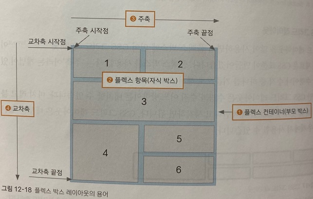

## 플렉스 박스 레이아웃 알아보기

플렉스 박스 레이아웃은 비교적 최근에 등장한 개념으로 기존의 CSS 속성 외에 새로 공부해야 할 속성이 있다.

***
### 플렉스 박스 레이아웃에서 사용하는 용어

 

플렉스 박스 레이아웃은 그리드 레이아웃을 기본으로 해서 새로 등장한 개념이므로 알아 둬야 할 새로운 용어가 많다.

1) 플렉스 컨테이너(부모 박스): 플렉스 박스 레이아웃을 적용할 대상을 묶는 요소이다.
2) 플렉스 항목(자식 박스): 플렉스 박스 레이아웃을 적용할 대상으로 1~6까지 작은 박스들이 모두 해당한다.
3)주축(main axis): 플렉스 컨테이너 안에서 플렉스 항목을 배치하는 기본 방향이다.
                    기본적으로 왼쪽에서 오른쪽이며 수평 방향으로 배치한다.
                    플렉스 항목의 배치가 시작되는 위치를 '주축 시작점', 
                    끝나는 위치를 '주축 끝점' 이라고 한다.
4) 교차축(cross axis): 주축과 교차하는 방향을 말하며 기본적으로 위에서 아래로 배치한다.
                        플렉스 항목의 배치가 시작되는 위치를 '교차축 시작점',
                        끝나는 위치를 '교차축 끝점'이라고 한다.

***
### 플렉스 박스 항목을 배치하는 속성

 

플렉스 박스에는 플렉스 항목이 여러개 있는데 일괄적으로 한꺼번에 배치할 수도 있고, 주축이나 교차축 기준으로 다양하게 배치할 수도 있다.

배치 방법과 관련된 속성이 많으므로 잘 숙지하자.

|종류|설명|
|----|----|
|justify-content|주축 방향의 정렬 방법이다.|
|align-items|교차축 방향의 정렬 방법이다.|
|align-self|교차축에 있는 개별 항목의 정렬 방법이다.|
|align-content|교차축에서 여러 줄로 표시된 항목의 정렬 방법이다.|

