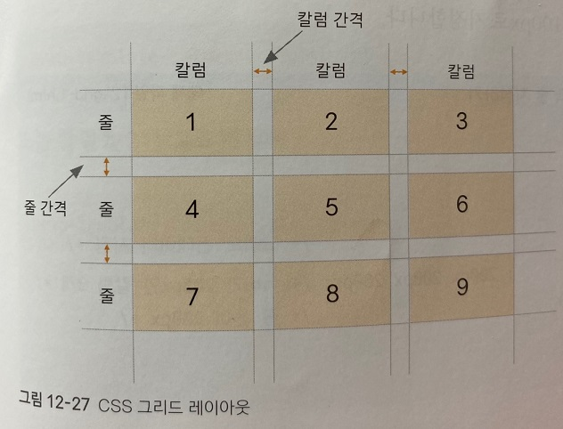

## CSS 그리드 레이아웃 사용하기

웹 디자인 레이아웃을 만들 때 그리드 레이아웃은 아주 중요하다.

웹 사이트를 제작할 때 고려해야 할 기기가 나날이 늘어나고 있기 때문이다.

소스를 최대한 간단하게 유지하면서 대부분의 기기에 대응할 수 있는 그리드 레이아웃 기법이 바로 CSS 그리드 레이아웃이다.

***
## CSS 그리드 레이아웃에서 사용하는 용어

 

플렉스 박스 레이아웃에서는 플렉스 항목을 배치할 때 가로나 세로 중에서 하나를 주축으로 정해 놓고 배치했다.

반면에 CSS 그리드 레아아웃에서는 그리드 항목을 배치할 때 가로와 세로를 모두 사용한다.
 
그래서 플레스 항목은 1차원이고

CSS 그리드 레아웃은 2차원이라고 한다.

 

CSS 그리드 레이아웃은 가로 방향을 가리키는 줄(row)과 세로 방향을 가리키는 칼럼(column)으로 웹 화면을 구성한다.

그리고 칼럼과 칼럼 사이, 줄과 줄 사이의 간격을 지정해서 원하는 형태의 레이아웃을 만든다.

CSS 그리드 레이아웃은 다음 그리과 같이 가로 열(줄, row)과 세로 행(칼럼, column)으로 구성된다.

항목 1, 4, 7이 하나의 칼럼이고

항목 2, 5, 8이 또 하나의 칼럼을 구성하여 모두 3개의 칼럼으로 이루어진다.

그리고 

항목 1, 2, 3이 하나의 줄이고

항목 4, 5, 6이 또 다른 줄을 구성하여 모두 3개의 가로 줄로 이루어진다.

