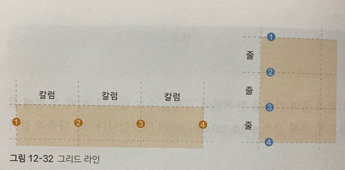
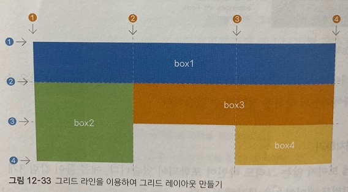
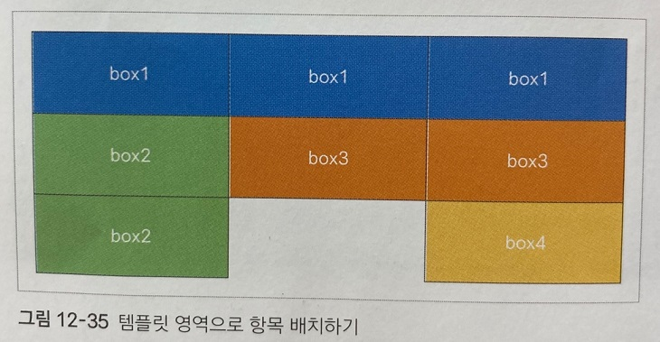

### 자동으로 칼럼 개수를 조절하는 auto-fill, auto-fit 값

 

앞에서 repeat() 함수를 사용해서 크기가 같은 칼럼을 반복할 때는 다음과 같이 칼럼의 개수를 지정했다.

    grid-template-columns: repeat(3, fr1);

이때 칼럼의 너빗값과 함께 auto-fit이나 auto-fill을 지정하면 화면 너비에 따라 칼럼 개수를 조절할 수 있다.

예를 들어 다음과 같이 너비가 200px인 칼럼을 화면 너비에 가득 찰 때까지 배치한다.

    grid-template-columns: ㄱ덷ㅁㅅ(auto-fit, 200px);

auto-fit이나 auto-fill 모두 칼럼 개수를 자동으로 조절해 주므로 화면이 넓어지면 칼럼 개수가 많아지고 반대로 화면이 좁아지면 칼럼 개수가 줄어든다.

두 값의 차이점은 남는 공간을 채울지 말지 여부에 달렸다.

***
### 그리드 항목의 간격을 지정하는 grid-column-gap, grid-row-gap, grid-gap 속성

 

기본으로 만들어지는 그리드 레이아웃은 항목이 서로 붙어있다.

이때 항목과 항목 사이의 간격을 조절하려면 다음과 같은 속성을 사용한다.

|종류|속성|
|----|----|
|grid-column-gap|칼럼과 칼럼 사이의 간격을 지정한다.|
|grid-row-gap|줄과 줄 사이의 간격을 지정한다.|
|grid-gap|칼럼과 줄 사이의 간격을 한꺼번에 지정한다.|

예를 들어 줄과 줄 사이의 간격을 20px로 하고, 칼럼과 칼럼 사이의 간격을 30px로 하려면 다음과 같이 지정할 수 있다.

    grid-row-gap: 20px;
    grid-column-gap: 30px;

grid-gap 속성을 이용해 칼럼과 줄의 간격을 한꺼번에 지정할 수도 있는데, 이때 첫 번째 값은 grid-row-gap에 해당하고 두 번째 값은 grid-column-gap에 해당한다.

이 외에도 플렉스 박스 레이아웃에서 살펴보았던 justify-content나 align-content 같은 속성을 사용하여 그리드 레이아웃의 항목을 정렬할 수 있다.

***
### 그리드 라인을 이용해 배치하기

 

그리드 레이아웃은 눈에 보이지 않는 그리드 라인이 포함되어 있다.

예를 들어 칼럼 3개와 줄 3개로 이루어진 그리드 레이아웃을 생각해 보자.

다음 그림처럼 칼럼 라인은 앞에서부터 차례로 1,2,3,4 번호가 매겨지므로 총 4개이다.

마찬가지로 줄에서도 촐 4개의 줄 라인이 있다.

이 그리드 라인을 이용해서 그리드 항목을 배치할 수 있는데, 이때 사용하는 속성은 다음과 같다.

|종류|설명|예시|
|----|----|----|
|grid-column-start|칼럼 시작의 라인 번호를 지정한다.|grid-column-start: 1|
|grid-column-end|칼럼 마지막의 라인 번호를 지정한다.|grid-column-end: 1|
|grid-column|칼럼 시작 번호와 칼럼 끝 번호 사이에 슬래시(/)를 넣어 사용한다.|grid-column: 1/4|
|grid-end-start|줄 시작의 라인 번호를 지정한다.|grid-end-start: 2|
|grid-row-end|줄 마지막의 라인 번호이다.|grid-row-end: 4|
|grid-row|줄 시작 번호와 줄 끝 번호 사이에 슬래시(/)를 넣어 사용한다.|grid-row: 2/4|

예를 들어 다음과 같은 그리드 레이아웃을 만든다고 가정해 보자

우선 box1부터 box4 영역까지 감싸고 있는 #wrapper 요소를 그리드 레이아웃 컨테이너로 지정하고, 칼럼은 1fr씩 3개로,

줄 높이는 minmax(3, 100px)로 지정한다.

    #wrapper{
      width:700px;
      display:grid;
      grid-template-columns:repeat(3, 1fr);
      grid-template-rows:repeat(3, 100px);
    }

    ...

    

        
box1

        
box2

        
box3

        
box4

    

box1 여역의 칼럼 라인은 1번부터 4번까지 차지하고 box2 영역의 칼럼 라인은 1번부터 2번까지, 줄 라인은 2번에서 4번까지 차지한다.

같은 방법으로 box3, box4 영역도 라인 번호를 이용해 배치할 수 있다.

항목을 배치할 때 칼럼이나 줄을 하나만 차지할 경우에는 grid-column-start나 grid-row-start 속성을 이용해 시작 번호만 지정하고 끝 번호는 지정하지 않아도 된다.

***
### 템플릿 영역을 만들어 배치하기 

 

앞에서 살펴본 그리드 라인은 시작 번호와 끝 번호를 일일이 지정해서 레이아웃을 만들어야 했다.

템플릿 영역으로 항목을 배치하면 그리드 레이아웃을 만드는 것보다 더 쉽다.

지금부터 템플릿 영역을 사용해서 앞에서 배치한 항목과 똑같은 레이아웃을 만들어 보자.

다음 그림처럼 첫 번째 줄에는 box1 영역을 3개 배치하고 두 번째 줄에는 box2 영역 1개와 box3 영역 2개, 

그리고 마지막 줄에는 box2 영역 1개와 중간을 비워 두고 마지막에 box4 영역 1개를 배치하면 된다.

 

맨 먼저 grid-area 속성을 사용해서 각 영역에 템플릿 이름을 지정해 준다.

다음은 4개 영역에 box1부터 box4까지 템플릿 이름을 지정한 예제이다.

    .box1 {
      background-color:#3689ff;
      grid-area:box1;
    }
    .box2 {
      background-color:#00cf12;
      grid-area:box2;
    }
    .box3 {
      background-color:#ff9019;
      grid-area:box3;
      }
    .box4 {
      background-color:#ffd000;
      grid-area:box4;
    }

    ...

    

        
box1

        
box2
 
        
box3

        
box4

    

이어서 그리드 컨테이너로 사용하는 #wrapper 요소에서 grid-template-areas 속성을 사용해 템플릿 영역을 어떻게 배치할지 지정한다.

템플릿 영역을 비워 두려면 그 자리에 마침표(.)를 넣는다. 한 줄에 들어갈 템플릿 영역을 큰따옴표(" ")로 묶어 주면 되는데, 

한 줄마다 줄 바꿈을 하면 마치 눈으로 보듯 템플릿 영역을 나열할 수 있어서 좀 더 쉽게 작성할 수 있다.