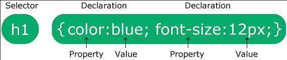

## CSS 구문

CSS 규칙은 선택기와 선언 블록으로 구성됩니다.

선택기는 스타일을 지정할 HTML 요소를 가리킵니다.

선언 블록에는 세미콜론으로 구분된 하나 이상의 선언이 있습니다.

각 선언에는 콜론으로 구분된 CSS 속성 이름과 값이 포함됩니다.

여러 CSS 선언은 세미콜론으로 구분하고 선언 블록은 중괄호로 묶습니다.

    예시
    이 예에서 모든 
 요소는 빨간색 텍스트 색상으로 가운데 정렬됩니다.

    p {
    color: red;
    text-align: center;
    }

예시 설명
- p CSS의 선택기입니다(스타일 지정하려는 HTML 요소: \
).
- color는 속성이고 red는 속성 값입니다.
- text-align는 속성이고 center는 속성 값입니다.