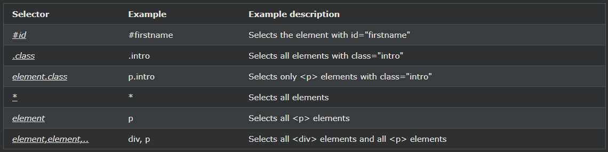

## CSS Selectors

CSS 선택기는 스타일을 지정할 HTML 요소를 선택합니다.

***
### CSS 선택기
CSS 선택기는 스타일을 지정하려는 HTML 요소를 "찾거나" 선택하는 데 사용됩니다.

CSS 선택기를 다섯 가지 범주로 나눌 수 있습니다.

- 단순 선택기(이름, ID, 클래스를 기반으로 요소 선택)
- 결합자 선택기 (특정 요소 간의 특정 관계를 기반으로 요소 선택)
- 유사 클래스 선택기 (특정 상태를 기반으로 요소 선택)
- 유사 요소 선택기 ( 요소 의 일부를 선택하고 스타일 지정)
- 속성 선택기 (속성 또는 속성 값을 기반으로 요소 선택)

이 페이지에서는 가장 기본적인 CSS 선택기에 대해 설명합니다.

***
### CSS 요소 선택기
요소 선택기는 요소 이름을 기반으로 HTML 요소를 선택합니다.

    예시
    여기에서 페이지의 모든 
 요소는 빨간색 텍스트 색상으로 가운데 정렬됩니다. 

    p {
    text-align: center;
    color: red;
    }

***
### CSS ID 선택기
id 선택기는 HTML 요소의 id 속성을 사용하여 특정 요소를 선택합니다.

요소의 id는 페이지 내에서 고유하므로 id 선택기를 사용하여 하나의 고유한 요소를 선택합니다!

특정 ID를 가진 요소를 선택하려면 해시(#) 문자와 요소 ID를 차례로 작성합니다.

    예시
    아래 CSS 규칙은 id="para1"인 HTML 요소에 적용됩니다. 

    #para1 {
    text-align: center;
    color: red;
    }

참고: ID 이름은 숫자로 시작할 수 없습니다!

***
### CSS 클래스 선택기
클래스 선택기는 특정 클래스 속성을 가진 HTML 요소를 선택합니다.

특정 클래스가 있는 요소를 선택하려면 마침표(.) 문자와 클래스 이름을 차례로 작성합니다.

    예시
    이 예에서 class="center"인 모든 HTML 요소는 빨간색으로 가운데 정렬됩니다. 

    .center {
    text-align: center;
    color: red;
    }

특정 HTML 요소만 클래스의 영향을 받도록 지정할 수도 있습니다.

    예시
    이 예에서는 class="center"인 
 요소만 빨간색으로 가운데 정렬됩니다. 

    p.center {
    text-align: center;
    color: red;
    }

HTML 요소는 둘 이상의 클래스를 참조할 수도 있습니다.

    예시
    이 예에서 
 요소는 class="center" 및 class="large"에 따라 스타일이 지정됩니다. 

    
This paragraph refers to two classes.

참고: 클래스 이름은 숫자로 시작할 수 없습니다!

***
### CSS 범용 선택기
범용 선택기(*)는 페이지의 모든 HTML 요소를 선택합니다.

    예시
    아래 CSS 규칙은 페이지의 모든 HTML 요소에 영향을 미칩니다. 

    * {
    text-align: center;
    color: blue;
    }

***
### CSS 그룹화 선택기
그룹화 선택기는 스타일 정의가 동일한 모든 HTML 요소를 선택합니다.

다음 CSS 코드를 보십시오(h1, h2 및 p 요소는 동일한 스타일 정의를 가짐).

    h1 {
    text-align: center;
    color: red;
    }

    h2 {
    text-align: center;
    color: red;
    }

    p {
    text-align: center;
    color: red;
    }

코드를 최소화하려면 선택기를 그룹화하는 것이 좋습니다.

선택기를 그룹화하려면 각 선택기를 쉼표로 구분합니다.

    예시
    이 예제에서는 위의 코드에서 선택자를 그룹화했습니다. 

    h1, h2, p {
    text-align: center;
    color: red;
    }

***
### 모든 CSS 단순 선택기

