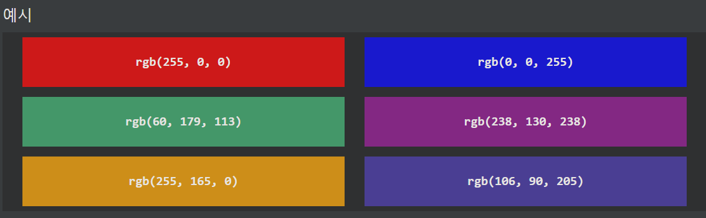
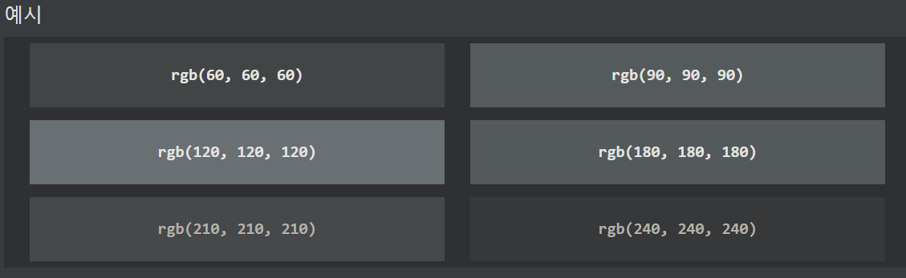
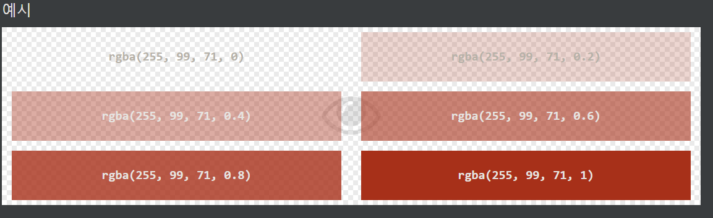

## CSS RGB 색상
RGB 색상 값은 RED, GREEN 및 BLUE 광원을 나타냅니다.

***
### RGB 값
CSS에서 색상은 다음 공식을 사용하여 RGB 값으로 지정할 수 있습니다.

RGB( 빨강, 초록 , 파랑 )

각 매개변수(빨간색, 녹색 및 파란색)는 0에서 255 사이의 색상 강도를 정의합니다.

예를 들어, rgb(255, 0, 0)는 빨간색이 가장 높은 값(255)으로 설정되고 나머지는 0으로 설정되기 때문에 빨간색으로 표시됩니다.

검은색을 표시하려면 rgb(0, 0, 0)와 같이 모든 색상 매개변수를 0으로 설정합니다.

흰색을 표시하려면 rgb(255, 255, 255)와 같이 모든 색상 매개변수를 255로 설정합니다.

회색 음영은 3가지 광원 모두에 대해 동일한 값을 사용하여 정의되는 경우가 많습니다.

***
### RGBA 값
RGBA 색상 값은 색상의 불투명도를 지정하는 알파 채널이 있는 RGB 색상 값의 확장입니다.

RGBA 색상 값은 다음으로 지정됩니다.

rgba( 빨강, 초록 , 파랑, 알파 )

알파 매개변수는 0.0(완전 투명)에서 1.0(전혀 투명하지 않음) 사이의 숫자입니다.

