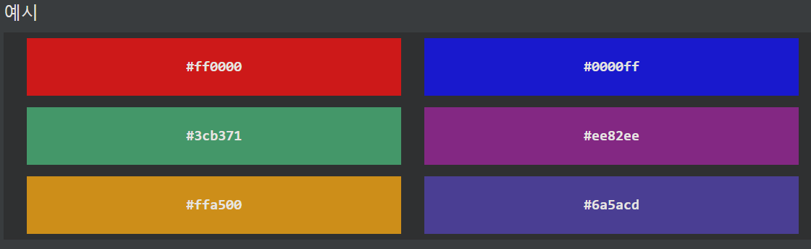
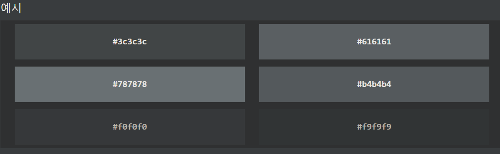

## CSS Hex Colors (16진수 색상)
16진수 색상은 #RRGGBB로 지정됩니다. 여기서 RR(빨간색), GG(녹색) 및 BB(파란색) 16진수 정수는 색상 구성 요소를 지정합니다.

***
### 16진수 값
CSS에서 색상은 다음 형식의 16진수 값을 사용하여 지정할 수 있습니다.

    # rggbb

여기서 rr(빨간색), gg(녹색) 및 bb(파란색)는 00과 ff 사이의 16진수 값입니다(10진수 0-255와 동일).

예를 들어 #ff0000은 빨간색이 가장 높은 값(ff)으로 설정되고 나머지는 가장 낮은 값(00)으로 설정되기 때문에 빨간색으로 표시됩니다.

검은색을 표시하려면 #000000과 같이 모든 값을 00으로 설정합니다.

흰색을 표시하려면 #ffffff와 같이 모든 값을 ff로 설정합니다.  

회색 음영은 3가지 광원 모두에 대해 동일한 값을 사용하여 정의되는 경우가 많습니다.

***
### 3자리 HEX 값
때때로 CSS 소스에서 3자리 16진수 코드를 볼 수 있습니다.

3자리 16진수 코드는 일부 6자리 16진수 코드의 약어입니다.

3자리 16진수 코드의 형식은 다음과 같습니다.

    # RGB

여기서 r, g 및 b는 0과 f 사이의 값을 가진 빨강, 녹색 및 파랑 구성 요소를 나타냅니다.

3자리 16진수 코드는 각 구성 요소에 대해 두 값(RR, GG 및 BB)이 동일한 경우에만 사용할 수 있습니다. 따라서 #ff00cc가 있으면 #f0c와 같이 작성할 수 있습니다.

    예시
    body {
    background-color: #fc9; /* same as #ffcc99 */
    }

    h1 {
    color: #f0f; /* same as #ff00ff */
    }

    p {
    color: #b58; /* same as #bb5588 */
    }