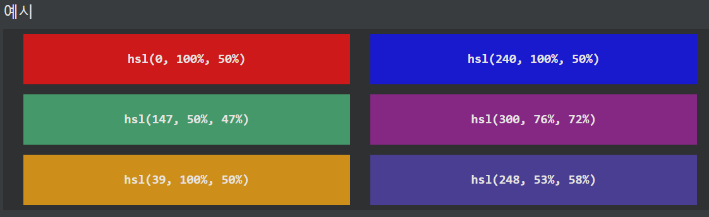
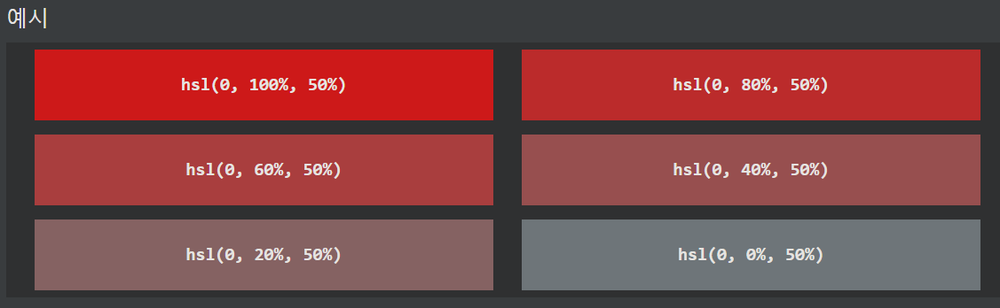
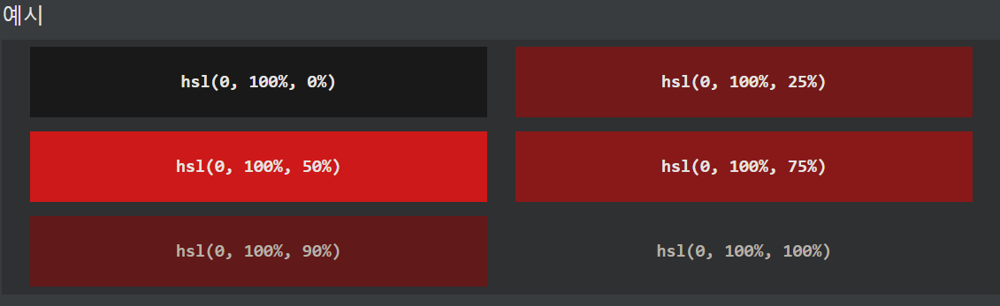
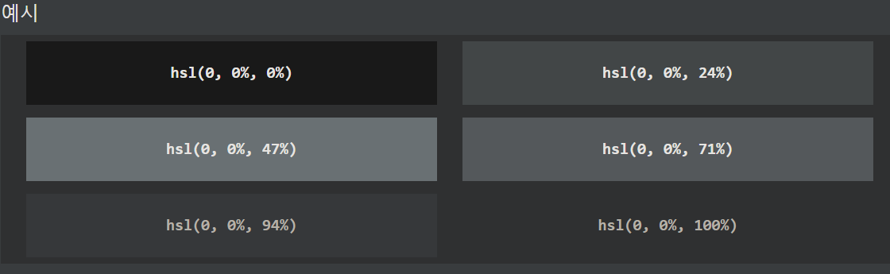
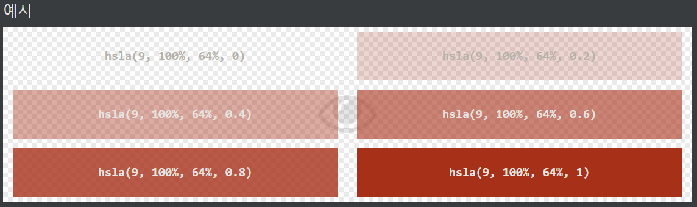

## CSS HSL 색상
HSL은 색조, 채도 및 밝기를 나타냅니다.

***
### HSL 값
CSS에서 색상은 다음 형식의 HSL(색조, 채도 및 밝기)을 사용하여 지정할 수 있습니다.

hsl( 색조 , 채도 , 밝기 )

색조는 0에서 360까지의 색상환의 정도입니다. 0은 빨간색, 120은 녹색, 240은 파란색입니다.

채도는 백분율 값이고 0%는 회색 음영을 의미하고 100%는 전체 색상을 의미합니다.

밝기도 백분율이고 0%는 검정색, 50%는 밝거나 어둡지 않음, 100%는 흰색입니다.

***
### 채도
채도는 색상의 강도로 설명할 수 있습니다.

100%는 회색 음영이 없는 순수한 색상입니다.

50%는 50% 회색이지만 여전히 색상을 볼 수 있습니다.

0%는 완전히 회색이며 더 이상 색상을 볼 수 없습니다.

***
### 밝기
색상의 밝기는 색상에 부여하고 싶은 빛의 양으로 설명할 수 있습니다. 

여기서 0%는 빛이 없음(검은색), 50%는 50%(어둡지도 밝지도 않음)를 의미하고 100%는 완전한 밝기(흰색)를 의미합니다.

***
### 회색 음영
회색 음영은 종종 색조와 채도를 0으로 설정하고 명도를 0%에서 100%로 조정하여 더 어둡거나 더 밝은 음영을 얻음으로써 정의됩니다.

***
### HSLA 값
HSLA 색상 값은 색상의 불투명도를 지정하는 알파 채널이 있는 HSL 색상 값의 확장입니다.

HSLA 색상 값은 다음과 같이 지정됩니다.

hsla( 색조, 채도 , 밝기, 알파 )

알파 매개변수는 0.0(완전 투명)에서 1.0(전혀 투명하지 않음) 사이의 숫자입니다.

