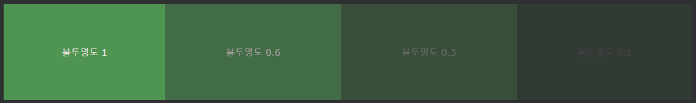
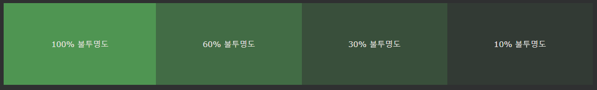

## CSS Backgrounds

CSS 배경 속성은 요소에 배경 효과를 추가하는 데 사용됩니다.

***
### CSS 배경색
background-color속성은 엘레멘트의 배경 색상을 지정합니다.

    예시
    페이지의 배경색은 다음과 같이 설정됩니다.

    body {
    background-color: lightblue;
    }

CSS에서 색상은 다음과 같이 가장 자주 지정됩니다.

- 유효한 색상 이름(예: "빨간색")
- 16진수 값 - 예: "#ff0000"
- RGB 값 - "rgb(255,0,0)"

참조:[CSS 색상 값](https://www.w3schools.com/cssref/css_colors_legal.asp)

***
### 기타 요소
모든 HTML 요소의 배경색을 설정할 수 있습니다.

    예시
    여기서 <h1>, 
 및 
 요소는 배경색이 다릅니다. 

    h1 {
    background-color: green;
    }

    div {
    background-color: lightblue;
    }

    p {
    background-color: yellow;
    }

***
### 불투명도/투명도
opacity속성은 요소의 불투명도 / 투명도를 지정합니다. 

0.0 - 1.0의 값을 사용할 수 있습니다. 값이 낮을수록 더 투명해집니다.

    예시
    div {
    background-color: green;
    opacity: 0.3;
    }

참고:opacity 속성을 사용하여 요소의 배경에 투명도를 추가하면 모든 하위 요소가 동일한 투명도를 상속합니다. 

이것은 완전히 투명한 요소 안의 텍스트를 읽기 어렵게 만들 수 있습니다.

***
### RGBA를 사용한 투명도
위의 예와 같이 하위 요소에 불투명도를 적용하지 않으려면 RGBA 색상 값을 사용하십시오. 

다음 예제에서는 텍스트가 아닌 배경색의 불투명도를 설정합니다.

CSS 색상 장에서 RGB를 색상 값으로 사용할 수 있다는 것을 배웠습니다 . 

RGB 외에도 색상 의 불투명도를 지정 하는 알파 채널(RGB A ) 과 함께 RGB 색상 값을 사용할 수 있습니다 .

RGBA 색상 값은 rgba(red, green, blue, alpha )로 지정됩니다. 알파 파라미터는 0.0 (완전히 투명), 1.0 (완전 불투명) 사이의 수이다.

    예시
    div {
    background: rgba(0, 128, 0, 0.3) /* Green background with 30% opacity */
    }