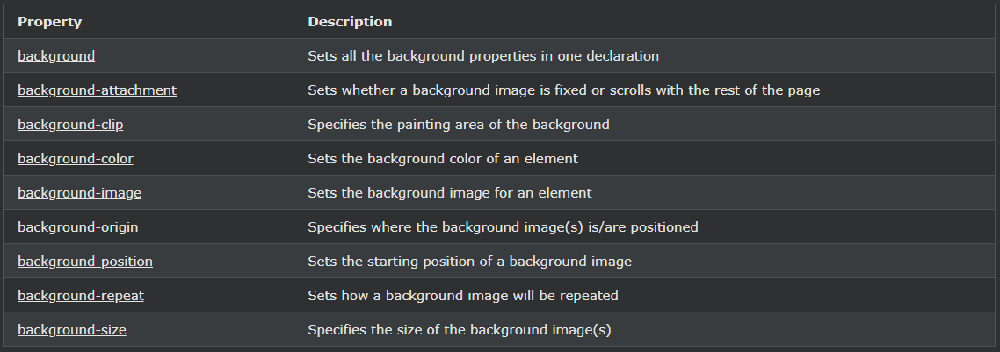

## CSS 배경 약식 속성

***
### CSS 배경 - 약식 속성
코드를 줄이기 위해 하나의 단일 속성에 모든 배경 속성을 지정할 수도 있습니다. 이것을 약식 속성이라고 합니다.

    body {
    background-color: #ffffff;
    background-image: url("img_tree.png");
    background-repeat: no-repeat;
    background-position: right top;
    }

위의 것을 기본으로 하여 약식 속성을 적용해 봅시다.

    예시
    속기 속성을 사용하여 하나의 선언에서 배경 속성을 설정합니다.

    body {
    background: #ffffff url("img_tree.png") no-repeat right top;
    }

약식 속성을 사용할 때 속성 값의 순서는 다음과 같습니다.

- background-color
- background-image
- background-repeat
- background-attachment
- background-position

다른 속성 값이 이 순서대로 있는 한 속성 값 중 하나가 누락되어도 문제가 되지 않습니다. 

위의 예에서 background-attachment 속성은 값이 없기 때문에 사용하지 않습니다.

***
### 모든 CSS 배경 속성

