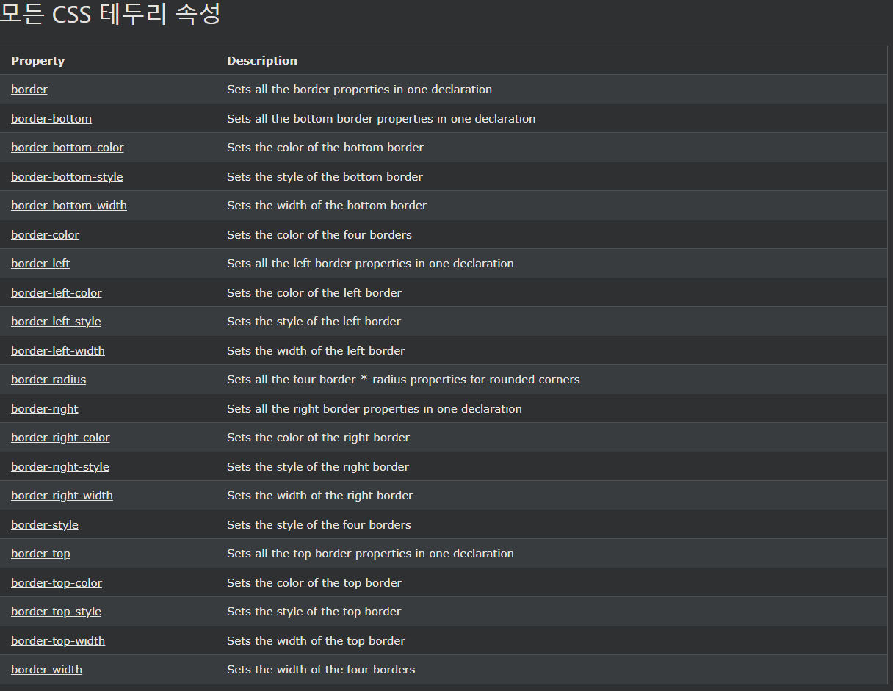

## CSS 둥근 테두리

***
### CSS 둥근 테두리
border-radius속성은 요소에 둥근 테두리를 추가하는 데 사용됩니다

예시
p {
  border: 2px solid red;
  border-radius: 5px;
}

더 많은 예:

[하나의 선언에 있는 모든 위쪽 테두리 속성](https://www.w3schools.com/css/tryit.asp?filename=trycss_border-top)
이 예제에서는 하나의 선언에서 위쪽 테두리에 대한 모든 속성을 설정하기 위한 약식 속성을 보여 줍니다.

[아래쪽 테두리의 스타일 설정](https://www.w3schools.com/css/tryit.asp?filename=trycss_border-bottom-style)
이 예제에서는 아래쪽 테두리 의 스타일을 설정하는 방법을 보여줍니다.

[왼쪽 테두리의 너비 설정](https://www.w3schools.com/css/tryit.asp?filename=trycss_border-left-width)
이 예제에서는 왼쪽 테두리 의 너비를 설정하는 방법을 보여줍니다.

[네 개의 테두리 색상 설정](https://www.w3schools.com/css/tryit.asp?filename=trycss_border-color)
이 예제에서는 네 개의 테두리 색상을 설정하는 방법을 보여줍니다. 하나에서 네 가지 색상을 가질 수 있습니다.

[오른쪽 테두리의 색상 설정](https://www.w3schools.com/css/tryit.asp?filename=trycss_border-right-color)
이 예제에서는 오른쪽 테두리 의 색상을 설정하는 방법을 보여줍니다.

