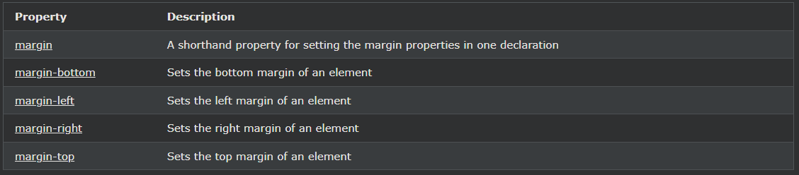

## CSS 여백 축소

때때로 두 개의 여백이 하나의 여백으로 축소됩니다.

***
### 여백 축소
요소의 상단 및 하단 여백은 때때로 두 여백 중 가장 큰 여백과 동일한 단일 여백으로 축소됩니다.

이것은 왼쪽과 오른쪽 여백에서 발생하지 않습니다! 상단 및 하단 여백만!

다음 예를 보십시오.

    마진 축소 예시:

    h1 {
    margin: 0 0 50px 0;
    }

    h2 {
    margin: 20px 0 0 0;
    }

위의 예에서 \<h1> 요소의 아래쪽 여백은 50px이고 \<h2> 요소의 위쪽 여백은 20px로 설정되어 있습니다.

상식적으로 \<h1>과 \<h2> 사이의 세로 여백은 총 70픽셀(50픽셀 + 20픽셀)이 되어야 한다고 제안하는 것 같습니다. 그러나 여백 축소로 인해 실제 여백은 50px가 됩니다.

***
### 모든 CSS 여백 속성

