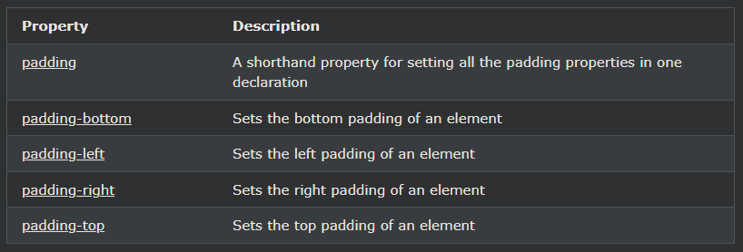

## CSS Padding

패딩은 정의된 테두리 내부의 요소 콘텐츠 주위에 공간을 만드는 데 사용됩니다.

***
### CSS 패딩
CSS padding속성은 정의된 테두리 내부의 요소 콘텐츠 주위에 공간을 생성하는 데 사용됩니다.

CSS를 사용하면 패딩을 완전히 제어할 수 있습니다. 요소의 각 측면(위, 오른쪽, 아래, 왼쪽)에 대한 패딩을 설정하는 속성이 있습니다.

***
### 패딩 - 개별면
CSS에는 요소의 각 측면에 대한 패딩을 지정하기 위한 속성이 있습니다.

- padding-top
- padding-right
- padding-bottom
- padding-left

모든 패딩 속성은 다음 값을 가질 수 있습니다.

- 길이 - px, pt, cm 등으로 패딩을 지정합니다.
- % - 포함하는 요소 너비의 %로 패딩을 지정합니다.
- 상속 - 패딩이 부모 요소에서 상속되어야 함을 지정합니다.

참고: 음수 값은 허용되지 않습니다.

    예시
    
 요소의 4면 모두에 대해 다른 패딩을 설정합니다.  

    div {
    padding-top: 50px;
    padding-right: 30px;
    padding-bottom: 50px;
    padding-left: 80px;
    }

***
### 패딩 - 약식 속성
코드를 줄이기 위해 하나의 속성에 모든 패딩 속성을 지정할 수 있습니다.

padding속성은 다음 각 패딩 속성에 대한 약식 속성이다 :

- padding-top
- padding-right
- padding-bottom
- padding-left

작동 방식은 다음과 같습니다.

4개의 패딩 값이 있는 경우 :

- 패딩: 25px 50px 75px 100px;
    - 상단 패딩은 25px입니다.
    - 오른쪽 패딩은 50px입니다.
    - 하단 패딩은 75px입니다.
    - 왼쪽 패딩은 100px입니다.

            예시

            4개의 값과 함께 패딩 속기 속성을 사용합니다.

            div {
            padding: 25px 50px 75px 100px;
            }

3개의 패딩 값이 있는 경우 :

- 패딩: 25px 50px 75px;
    - 상단 패딩은 25px입니다.
    - 오른쪽 및 왼쪽 패딩은 50px입니다.
    - 하단 패딩은 75px입니다.

            예시
            다음 세 가지 값과 함께 패딩 속기 속성을 사용합니다. 

            div {
            padding: 25px 50px 75px;
            }

2개의 패딩 값이 있는 경우 :

- 패딩: 25px 50px;
    - 상단 및 하단 패딩은 25px입니다.
    - 오른쪽 및 왼쪽 패딩은 50px입니다.

            예시
            두 개의 값과 함께 패딩 속기 속성을 사용합니다. 

            div {
            padding: 25px 50px;
            }

1개의 패딩 값이 있는 경우 :

- 패딩: 25px;
    - 4개의 패딩은 모두 25px입니다.

            예시
            하나의 값과 함께 패딩 속기 속성을 사용합니다. 

            div {
            padding: 25px;
            }

***
### 패딩 및 요소 너비
CSS width속성은 요소의 콘텐츠 영역 너비를 지정합니다. 

콘텐츠 영역은 요소( box model ) 의 패딩, 테두리 및 여백 내부의 부분 입니다.

따라서 요소에 지정된 너비가 있는 경우 해당 요소에 추가된 패딩이 요소의 전체 너비에 추가됩니다. 

이것은 종종 바람직하지 않은 결과입니다.

    예시
    여기서 
 요소의 너비는 300px입니다. 그러나 
 요소의 실제 너비는 350px(300px + 왼쪽 패딩 25px + 오른쪽 패딩 25px)입니다.

    div {
    width: 300px;
    padding: 25px;
    }

패딩의 양에 관계없이 너비를 300px로 유지하려면 box-sizing속성을 사용할 수 있습니다. 

이렇게 하면 요소가 실제 너비를 유지합니다. 

패딩을 늘리면 사용 가능한 콘텐츠 공간이 줄어듭니다.

    예시
    패딩의 양에 관계없이 너비를 300px로 유지하려면 box-sizing 속성을 사용하십시오.

    div {
    width: 300px;
    padding: 25px;
    box-sizing: border-box;
    }

***
### 더 많은 예
[왼쪽 패딩 설정](https://www.w3schools.com/css/tryit.asp?filename=trycss_padding-left)
이 예제에서는 \
 요소의 왼쪽 패딩을 설정하는 방법을 보여줍니다.

[오른쪽 패딩 설정](https://www.w3schools.com/css/tryit.asp?filename=trycss_padding-right)
이 예제에서는 \
 요소의 오른쪽 패딩을 설정하는 방법을 보여줍니다.

[상단 패딩 설정](https://www.w3schools.com/css/tryit.asp?filename=trycss_padding-top)
이 예제에서는 \
 요소의 상단 패딩을 설정하는 방법을 보여줍니다.

[하단 패딩 설정](https://www.w3schools.com/css/tryit.asp?filename=trycss_padding-bottom)
이 예제에서는 \
 요소의 하단 패딩을 설정하는 방법을 보여줍니다.

***
### 모든 CSS 패딩 속성

