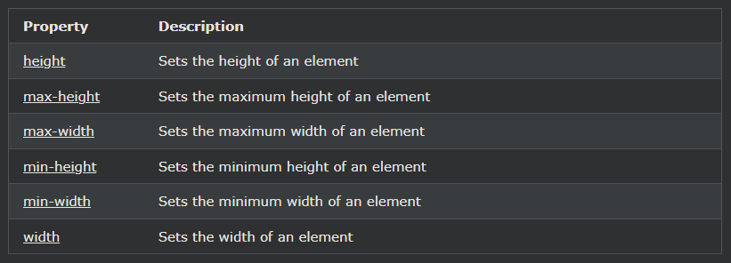

## CSS 높이 및 너비
CSS height와 width속성은 요소의 높이와 너비를 설정하는 데 사용됩니다.

CSS max-width속성은 요소의 최대 너비를 설정하는 데 사용됩니다.

***
### CSS 높이 및 너비 설정
height및 width특성 요소의 높이와 폭을 설정하는 데 사용된다.

높이 및 너비 속성에는 패딩, 테두리 또는 여백이 포함되지 않습니다. 요소의 패딩, 테두리 및 여백 내부 영역의 높이/너비를 설정합니다.

***
### CSS 높이 및 너비 값
height및 width속성은 다음과 같은 값을 가질 수 있습니다 :

- auto- 기본값입니다. 브라우저는 높이와 너비를 계산합니다.
- length - px, cm 등으로 높이/너비를 정의합니다.
- % - 포함하는 블록의 높이/너비를 백분율로 정의합니다.
- initial - 높이/너비를 기본값으로 설정합니다.
- inherit - 높이/너비는 부모 값에서 상속됩니다.

***
### CSS 높이 및 너비 예

    예시1
    
 요소의 높이와 너비를 설정합니다.

    div {
    height: 200px;
    width: 50%;
    background-color: powderblue;
    }

    예시2
    다른 
 요소의 높이와 너비를 설정합니다.

    div {
    height: 100px;
    width: 500px;
    background-color: powderblue;
    }

참고 : 기억 height과 width특성이 패딩, 테두리, 또는 여백을 포함하지 않습니다! 요소의 패딩, 테두리 및 여백 내부 영역의 높이/너비를 설정합니다!

***
### 최대 너비 설정
max-width속성은 요소의 최대 폭을 설정하기 위해 사용된다.

최대 너비는 px, cm 등과 같은 길이 값 또는 포함 블록의 백분율(%)로 지정하거나 없음으로 설정할 수 있습니다(기본값, 최대 너비가 없음을 의미합니다.)

\
위와 같은 문제 는 브라우저 창이 요소의 너비(500px)보다 작을 때 발생합니다. 그런 다음 브라우저는 페이지에 가로 스크롤 막대를 추가합니다.

max-width이 상황에서 대신 사용 하면 브라우저의 작은 창 처리가 향상됩니다.

팁: 브라우저 창을 500px 너비보다 작게 드래그하여 두 div의 차이점을 확인하세요!

참고 : 어떤 이유로 인해 동일한 요소에 너비 속성과 최대 너비 속성을 모두 사용하고 너비 속성의 값이 최대 너비 속성보다 큰 경우 최대 너비 속성이 사용되고 너비 속성은 무시됩니다.

    예시
    이 
 요소는 높이가 100픽셀이고 최대 너비가 500픽셀입니다. 

    div {
    max-width: 500px;
    height: 100px;
    background-color: powderblue;
    }

***
[요소의 높이 및 너비 설정](https://www.w3schools.com/css/tryit.asp?filename=trycss_dim_height)
이 예제에서는 다양한 요소의 높이와 너비를 설정하는 방법을 보여줍니다.

[퍼센트를 사용하여 이미지의 높이 및 너비 설정](https://www.w3schools.com/css/tryit.asp?filename=trycss_dim_height_percent)
의 높이와 너비 설정 이 예제에서는 백분율 값을 사용하여 이미지의 높이와 너비를 설정하는 방법을 보여줍니다.

[요소의 최소 너비 및 최대 너비 설정](https://www.w3schools.com/css/tryit.asp?filename=trycss_dim_max-width)
의 최소 ​​너비 및 최대 너비 설정 이 예제에서는 픽셀 값을 사용하여 요소의 최소 너비와 최대 너비를 설정하는 방법을 보여 줍니다.

[요소의 최소 높이 및 최대 높이 설정](https://www.w3schools.com/css/tryit.asp?filename=trycss_dim_max-height)
의 최소 ​​높이 및 최대 높이 설정 이 예제에서는 픽셀 값을 사용하여 요소의 최소 높이와 최대 높이를 설정하는 방법을 보여줍니다.

***
### 모든 CSS 치수 속성

