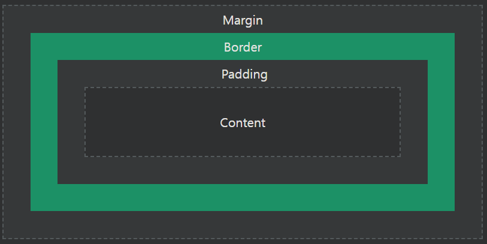

## CSS Box Model

모든 HTML 요소는 상자로 간주될 수 있습니다.

***
### CSS 상자 모델
CSS에서 "박스 모델"이라는 용어는 디자인과 레이아웃에 대해 이야기할 때 사용됩니다.

CSS 상자 모델은 기본적으로 모든 HTML 요소를 감싸는 상자입니다. 

여백, 테두리, 패딩 및 실제 콘텐츠로 구성됩니다. 

아래 이미지는 상자 모델을 보여줍니다.

각 부분에 대한 설명:

- 콘텐츠 - 텍스트와 이미지가 표시되는 상자의 내용
- 패딩 - 콘텐츠 주변 영역을 지웁니다. 패딩이 투명하다
- 테두리 - 패딩과 콘텐츠를 둘러싸는 테두리
- 마진 - 테두리 밖의 영역을 지웁니다. 여백이 투명하다

상자 모델을 사용하면 요소 주위에 테두리를 추가하고 요소 사이의 공간을 정의할 수 있습니다. 

    예시
    박스 모델 시연:

    div {
    width: 300px;
    border: 15px solid green;
    padding: 50px;
    margin: 20px;
    }

***
### 요소의 너비와 높이
모든 브라우저에서 요소의 너비와 높이를 올바르게 설정하려면 상자 모델이 어떻게 작동하는지 알아야 합니다.

중요: CSS로 요소의 너비 및 높이 속성을 설정할 때 콘텐츠 영역 의 너비와 높이만 설정하면 됩니다. 요소의 전체 크기를 계산하려면 패딩, 테두리 및 여백도 추가해야 합니다.

    예시
    이 
 요소의 총 너비는 350px입니다. 

    div {
    width: 320px;
    padding: 10px;
    border: 5px solid gray;
    margin: 0;
    }

계산은 다음과 같습니다.

- 320px(너비)
-  20px(왼쪽 + 오른쪽 패딩)
-  10px(왼쪽 + 오른쪽 테두리)
-  0px(왼쪽 + 오른쪽 여백)
= 350px

요소의 전체 너비는 다음과 같이 계산해야 합니다.

전체 요소 너비 = 너비 + 왼쪽 패딩 + 오른쪽 패딩 + 왼쪽 테두리 + 오른쪽 테두리 + 왼쪽 여백 + 오른쪽 여백

요소의 총 높이는 다음과 같이 계산해야 합니다.

전체 요소 높이 = 높이 + 상단 패딩 + 하단 패딩 + 상단 테두리 + 하단 테두리 + 상단 여백 + 하단 여백