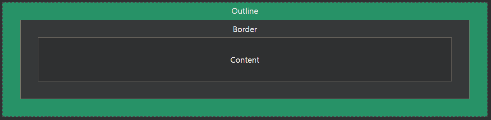
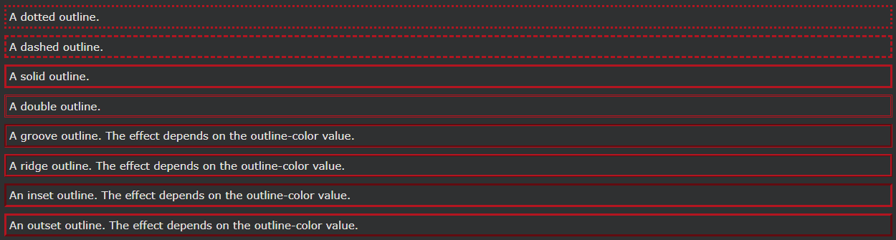

## CSS Outline

윤곽선은 요소의 테두리 외부에 그려진 선입니다.

---

### CSS 개요

윤곽선은 요소를 "눈에 띄게" 만들기 위해 테두리 OUTSIDE 요소 주위에 그려지는 선입니다.

CSS에는 다음과 같은 개요 속성이 있습니다.

- outline-style
- outline-color
- outline-width
- outline-offset
- outline

참고: 외곽선은 테두리 와 다릅니다 ! 테두리와 달리 윤곽선은 요소의 테두리 외부에 그려지며 다른 내용과 겹칠 수 있습니다. 또한 윤곽선은 요소 차원의 일부가 아닙니다. 요소의 전체 너비와 높이는 윤곽선 너비의 영향을 받지 않습니다.

---

### CSS 개요 스타일

이 outline-style속성은 윤곽선의 스타일을 지정하며 다음 값 중 하나를 가질 수 있습니다.

- dotted - 점선 윤곽을 정의합니다.
- dashed - 점선 윤곽을 정의합니다.
- solid - 실선을 정의합니다.
- double - 이중 윤곽선 정의
- groove - 3D 홈이 있는 윤곽을 정의합니다.
- ridge - 3D 융기된 윤곽을 정의합니다.
- inset - 3D 삽입 윤곽을 정의합니다.
- outset - 3D 아웃셋 아웃라인 정의
- none - 윤곽을 정의하지 않음
- hidden - 숨겨진 윤곽선 정의

다음 예에서는 다양한 outline-style값을 보여줍니다 .

    예시
    다양한 윤곽선 스타일 시연:

    p.dotted {outline-style: dotted;}
    p.dashed {outline-style: dashed;}
    p.solid {outline-style: solid;}
    p.double {outline-style: double;}
    p.groove {outline-style: groove;}
    p.ridge {outline-style: ridge;}
    p.inset {outline-style: inset;}
    p.outset {outline-style: outset;}

참고: 다른 개요 속성은 outline-style속성이 설정되어 있지 않으면 아무 효과도 없습니다 !
