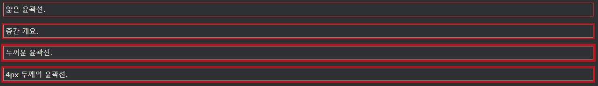

## CSS Outline Width

CSS 윤곽선 너비
outline-width속성 윤곽의 폭을 지정하고, 다음 값 중 하나를 가질 수있다 :

- 얇은(일반적으로 1px)
- 중간(일반적으로 3px)
- 두꺼운(일반적으로 5px)
- 특정 크기(px, pt, cm, em 등)

다음 예에서는 너비가 다른 일부 윤곽선을 보여줍니다.

    예시
    p.ex1 {
    border: 1px solid black;
    outline-style: solid;
    outline-color: red;
    outline-width: thin;
    }

    p.ex2 {
    border: 1px solid black;
    outline-style: solid;
    outline-color: red;
    outline-width: medium;
    }

    p.ex3 {
    border: 1px solid black;
    outline-style: solid;
    outline-color: red;
    outline-width: thick;
    }

    p.ex4 {
    border: 1px solid black;
    outline-style: solid;
    outline-color: red;
    outline-width: 4px;
    }
