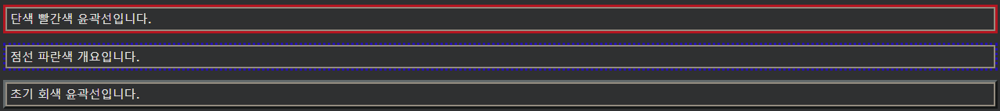
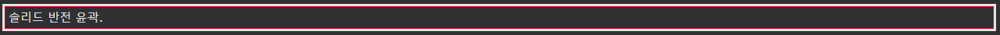

## CSS Outline Color

---

CSS 윤곽선 색상
outline-color속성은 외곽선의 색상을 설정하는 데 사용됩니다.

색상은 다음과 같이 설정할 수 있습니다.

- 이름 - "빨간색"과 같은 색상 이름을 지정합니다.
- HEX - "#ff0000"과 같은 16진수 값을 지정합니다.
- RGB - "rgb(255,0,0)"과 같은 RGB 값 지정
- HSL - "hsl(0, 100%, 50%)"와 같은 HSL 값을 지정합니다.
- 반전 - 색상 반전을 수행합니다(색상 배경에 관계없이 윤곽선이 표시되도록 함).

다음 예에서는 색상이 다른 몇 가지 다른 윤곽선을 보여줍니다. 또한 이러한 요소에는 윤곽선 내부에 얇은 검은색 테두리가 있습니다.

    예시
    p.ex1 {
    border: 2px solid black;
    outline-style: solid;
    outline-color: red;
    }

    p.ex2 {
    border: 2px solid black;
    outline-style: dotted;
    outline-color: blue;
    }

    p.ex3 {
    border: 2px solid black;
    outline-style: outset;
    outline-color: grey;
    }

---

### 16진수 값

윤곽선 색상은 16진수 값(HEX)을 사용하여 지정할 수도 있습니다.

    예시
    p.ex1 {
    outline-style: solid;
    outline-color: #ff0000; /* red */
    }

---

### RGB 값

또는 RGB 값을 사용하여:

    예시
    p.ex1 {
    outline-style: solid;
    outline-color: rgb(255, 0, 0); /* red */
    }

---

### HSL 값

HSL 값을 사용할 수도 있습니다.

    예시
    p.ex1 {
    outline-style: solid;
    outline-color: hsl(0, 100%, 50%); /* red */
    }

---

### 색상 반전

다음 예제에서는 색상 반전을 수행하는 outline-color: invert를 사용 합니다. 이렇게 하면 색상 배경에 관계없이 윤곽선이 표시됩니다.

    예시
    p.ex1 {
    border: 1px solid red;
    outline-style: solid;
    outline-color: invert;
    }
