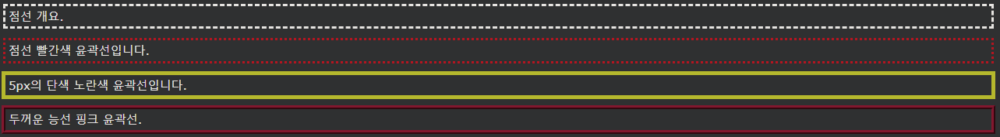

## CSS Outline Shorthand

---

### CSS 개요 - 약식 속성

outline속성은 다음 각 윤곽 속성을 설정하는 약식 속성이다 :

- outline-width
- outline-style (필수)
- outline-color

outline속성은 상기 목록에서 하나, 2 또는 3의 값으로 지정된다. 값의 순서는 중요하지 않습니다.

다음 예에서는 shorthand outline 속성으로 지정된 일부 개요를 보여줍니다 .

    예시
    p.ex1 {outline: dashed;}
    p.ex2 {outline: dotted red;}
    p.ex3 {outline: 5px solid yellow;}
    p.ex4 {outline: thick ridge pink;}
