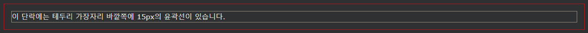
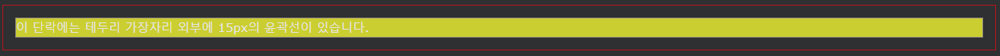
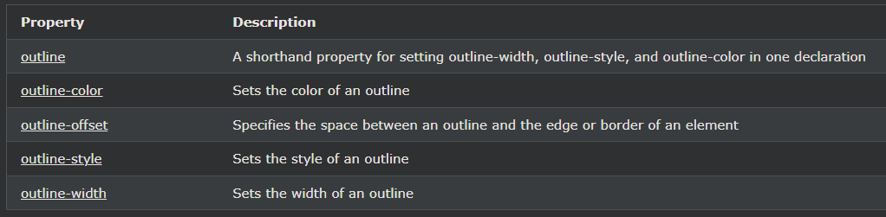

## CSS Outline Offset

---

### CSS 아웃라인 오프셋

이 outline-offset속성은 윤곽선과 요소의 가장자리/테두리 사이에 공간을 추가합니다.

요소와 윤곽선 사이의 공간은 투명합니다.

다음 예에서는 테두리 가장자리 외부 15px의 윤곽선을 지정합니다.

    예시
    p {
    margin: 30px;
    border: 1px solid black;
    outline: 1px solid red;
    outline-offset: 15px;
    }

다음 예는 요소와 윤곽선 사이의 공간이 투명함을 보여줍니다.

    예시
    p {
    margin: 30px;
    background: yellow;
    border: 1px solid black;
    outline: 1px solid red;
    outline-offset: 15px;
    }

---

### 모든 CSS 개요 속성

