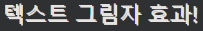
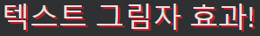
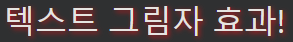
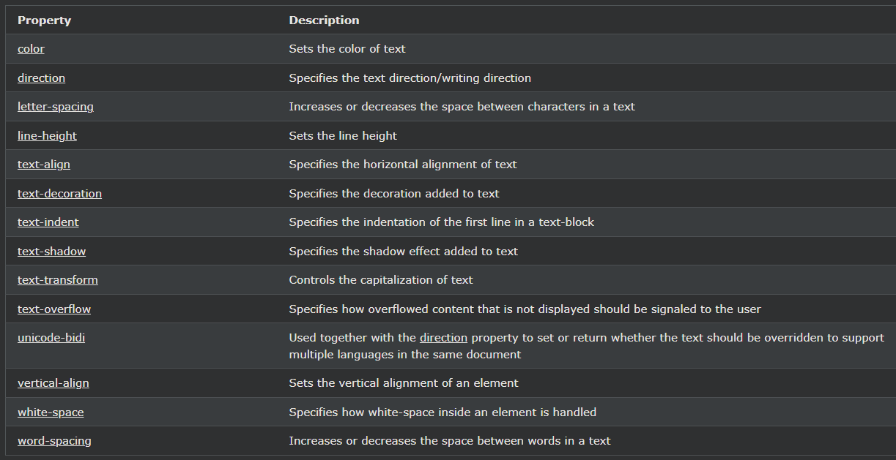

## CSS Text Shadow

---

### 텍스트 그림자

text-shadow속성은 텍스트에 그림자를 추가합니다.

가장 간단한 사용에서는 가로 그림자(2px)와 세로 그림자(2px)만 지정합니다.

    예시
    h1 {
    text-shadow: 2px 2px;
    }

다음으로 그림자에 색상(빨간색)을 추가합니다.

    예시
    h1 {
    text-shadow: 2px 2px red;
    }

그런 다음 그림자에 흐림 효과(5px)를 추가합니다.

    텍스트 그림자 효과!
    예시
    h1 {
    text-shadow: 2px 2px 5px red;
    }

---

### 더 많은 텍스트 그림자 예제

    실시예 1
    흰색 텍스트에 텍스트 그림자:

    h1 {
    color: white;
    text-shadow: 2px 2px 4px #000000;
    }

    실시예 2
    빨간색 네온 광선이 있는 텍스트 그림자:

    h1 {
    text-shadow: 0 0 3px #ff0000;
    }

    실시예 3
    빨간색과 파란색 네온 광선이 있는 텍스트 그림자:

    h1 {
    text-shadow: 0 0 3px #ff0000, 0 0 5px #0000ff;
    }

    실시예 4
    h1 {
    color: white;
    text-shadow: 1px 1px 2px black, 0 0 25px blue, 0 0 5px darkblue;
    }

---

### 모든 CSS 텍스트 속성

