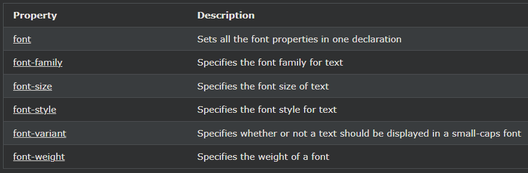

## CSS Font Property

---

### CSS 글꼴 속성

코드를 줄이기 위해 하나의 속성에 모든 개별 글꼴 속성을 지정할 수도 있습니다.

font속성에 대한 약식 속성이다 :

- font-style
- font-variant
- font-weight
- font-size/line-height
- font-family

참고 :font-size 와 font-family 값이 필요합니다. 다른 값 중 하나가 누락된 경우 해당 기본값이 사용됩니다.

    예시
    font하나의 선언에서 여러 글꼴 속성을 설정하는 데 사용 합니다.

    p.a {
    font: 20px Arial, sans-serif;
    }

    p.b {
    font: italic small-caps bold 12px/30px Georgia, serif;
    }

---

### 모든 CSS 글꼴 속성

