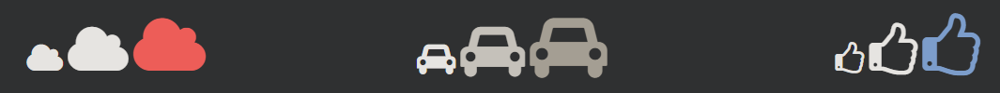

## CSS Icons

아이콘 라이브러리를 사용하여 HTML 페이지에 아이콘을 쉽게 추가할 수 있습니다.

---

### 아이콘을 추가하는 방법

HTML 페이지에 아이콘을 추가하는 가장 간단한 방법은 Font Awesome과 같은 아이콘 라이브러리를 사용하는 것입니다.

지정된 아이콘 클래스의 이름을 인라인 HTML 요소(예: \<i>또는 \)에 추가합니다.

아래 아이콘 라이브러리의 모든 아이콘은 CSS(크기, 색상, 그림자 등)로 사용자 정의할 수 있는 확장 가능한 벡터입니다.

---

### 글꼴 멋진 아이콘

Font Awesome 아이콘을 사용하려면 fontawesome.com 으로 이동하여 로그인하고 \<head>HTML 페이지 섹션에 추가할 코드를 받으십시오.

    

Font Awesome 5 튜토리얼 에서 Font Awesome을 시작하는 방법에 대해 자세히 알아보세요 .

참고: 다운로드 또는 설치가 필요하지 않습니다!

    예시

    <!DOCTYPE html>
    <html>
    <head>
    
    </head>
    <body>

    <i class="fas fa-cloud"></i>
    <i class="fas fa-heart"></i>
    <i class="fas fa-car"></i>
    <i class="fas fa-file"></i>
    <i class="fas fa-bars"></i>

    </body>
    </html>

모든 Font Awesome 아이콘에 대한 전체 참조를 보려면 [Icon Reference](https://www.w3schools.com/icons/icons_reference.asp) 를 방문하십시오.

---

### 부트스트랩 아이콘

부트스트랩 글리프콘을 사용하려면 \<head>HTML 페이지 섹션 안에 다음 줄을 추가 하세요.

    <link rel="stylesheet" href="https://maxcdn.bootstrapcdn.com/bootstrap/3.3.7/css/bootstrap.min.css">

참고: 다운로드 또는 설치가 필요하지 않습니다!

    예시

    <!DOCTYPE html>
    <html>
    <head>
    <link rel="stylesheet" href="https://maxcdn.bootstrapcdn.com/bootstrap/3.3.7/css/bootstrap.min.css">
    </head>
    <body>

    <i class="glyphicon glyphicon-cloud"></i>
    <i class="glyphicon glyphicon-remove"></i>
    <i class="glyphicon glyphicon-user"></i>
    <i class="glyphicon glyphicon-envelope"></i>
    <i class="glyphicon glyphicon-thumbs-up"></i>

    </body>
    </html>

---

### 구글 아이콘

Google 아이콘을 사용하려면 \<head>HTML 페이지 섹션 안에 다음 줄을 추가 하세요.

    <link rel="stylesheet" href="https://fonts.googleapis.com/icon?family=Material+Icons">

참고: 다운로드 또는 설치가 필요하지 않습니다!

    예시

    <!DOCTYPE html>
    <html>
    <head>
    <link rel="stylesheet" href="https://fonts.googleapis.com/icon?family=Material+Icons">
    </head>
    <body>

    <i class="material-icons">cloud</i>
    <i class="material-icons">favorite</i>
    <i class="material-icons">attachment</i>
    <i class="material-icons">computer</i>
    <i class="material-icons">traffic</i>

    </body>
    </html>
