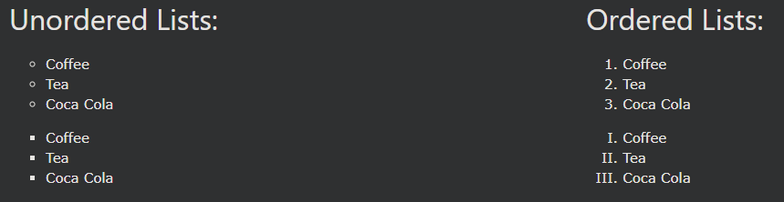
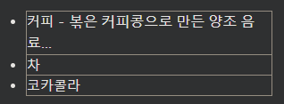
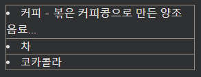
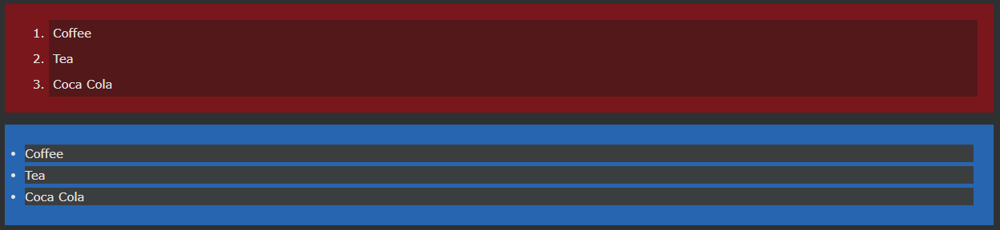
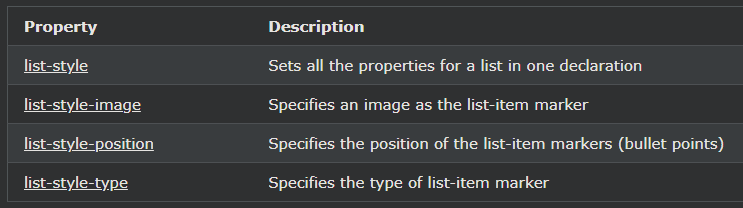

## CSS Lists

---

### HTML 목록 및 CSS 목록 속성

HTML에는 두 가지 주요 유형의 목록이 있습니다.

- 정렬되지 않은 목록(\<ul>) - 목록 항목은 글머리 기호로 표시됩니다.
- 정렬된 목록(\<ol>) - 목록 항목은 숫자 또는 문자로 표시됩니다.

CSS 목록 속성을 사용하면 다음을 수행할 수 있습니다.

- 순서가 지정된 목록에 대해 다른 목록 항목 마커 설정
- 순서가 지정되지 않은 목록에 대해 다른 목록 항목 마커 설정
- 이미지를 목록 항목 마커로 설정
- 목록 및 목록 항목에 배경색 추가

---

### 다른 목록 항목 마커

list-style-type속성은 목록 항목 마커의 유형을 지정합니다.

다음 예는 사용 가능한 목록 항목 마커 중 일부를 보여줍니다.

    예시
    ul.a {
    list-style-type: circle;
    }

    ul.b {
    list-style-type: square;
    }

    ol.c {
    list-style-type: upper-roman;
    }

    ol.d {
    list-style-type: lower-alpha;
    }

참고: 일부 값은 순서가 지정되지 않은 목록에 대한 것이고 일부는 순서가 지정된 목록에 대한 것입니다.

---

### 목록 항목 마커로서의 이미지

list-style-image속성은 목록 항목 마커 같은 이미지를 지정합니다 :

    예시
    ul {
    list-style-image: url('sqpurple.gif');
    }

---

### 목록 항목 마커 배치

list-style-position속성은 목록 항목 마커 (불릿 포인트)의 위치를 지정합니다.

"list-style-position: inside;" 글머리 기호가 목록 항목 외부에 있음을 의미합니다.

목록 항목의 각 줄의 시작은 세로로 정렬됩니다. 기본값은 다음과 같습니다.

"list-style-position: inside;" 글머리 기호가 목록 항목 안에 있음을 의미합니다.

목록 항목의 일부이므로 텍스트의 일부가 되고 시작 부분에서 텍스트를 푸시합니다.

    예시
    ul.a {
    list-style-position: outside;
    }

    ul.b {
    list-style-position: inside;
    }

---

### 기본 설정 제거

list-style-type:none속성은 또한 마커 / 불릿 포인트를 제거하는 데 사용할 수 있습니다.

목록에는 기본 여백과 패딩도 있습니다. 이를 제거하려면 추가 margin:0및 padding:0에 \<UL> 또는 \<OL>

    예시
    ul {
    list-style-type: none;
    margin: 0;
    padding: 0;
    }

---

### 목록 - 약식 속성

list-style속성은 약식 속성입니다. 하나의 선언에서 모든 목록 속성을 설정하는 데 사용됩니다.

    예시
    ul {
    list-style: square inside url("sqpurple.gif");
    }

약식 속성을 사용할 때 속성 값의 순서는 다음과 같습니다.

- list-style-type (list-style-image가 지정된 경우 어떤 이유로 이미지를 표시할 수 없는 경우 이 속성의 값이 표시됩니다)
- list-style-position (목록 항목 마커가 콘텐츠 흐름 내부 또는 외부에 나타나야 하는지 여부를 지정합니다)
- list-style-image (이미지를 목록 항목 마커로 지정)

위의 속성 값 중 하나가 누락된 경우 누락된 속성의 기본값(있는 경우)이 삽입됩니다.

---

### 색상이 있는 스타일링 목록

색상으로 목록의 스타일을 지정하여 좀 더 흥미롭게 만들 수도 있습니다.

\<ol> 또는 \<ul> 태그에 추가된 모든 항목은 전체 목록에 영향을 미치는 반면 \<li> 태그에 추가된 속성은 개별 목록 항목에 영향을 미칩니다.

    예시
    ol {
    background: #ff9999;
    padding: 20px;
    }

    ul {
    background: #3399ff;
    padding: 20px;
    }

    ol li {
    background: #ffe5e5;
    padding: 5px;
    margin-left: 35px;
    }

    ul li {
    background: #cce5ff;
    margin: 5px;
    }

---

### 더 많은 예

[빨간색 왼쪽 테두리가 있는 사용자 지정 목록](https://www.w3schools.com/css/tryit.asp?filename=trycss_list-style-red-border)
이 예에서는 [빨간색 왼쪽 테두리가 있는 목록](https://www.w3schools.com/css/tryit.asp?filename=trycss_list-style-red-border)을 만드는 방법을 보여줍니다.

[전체 너비 테두리 목록](https://www.w3schools.com/css/tryit.asp?filename=trycss_list-style-border)
이 예에서는 글머리 기호 없이 테두리 목록을 만드는 방법을 보여 줍니다.

[목록에 대한 모든 다른 목록-항목 마커](https://www.w3schools.com/css/tryit.asp?filename=trycss_list-style-type_all)
이 예는 CSS의 모든 다른 목록-항목 마커를 보여줍니다.

---

### 모든 CSS 목록 속성

