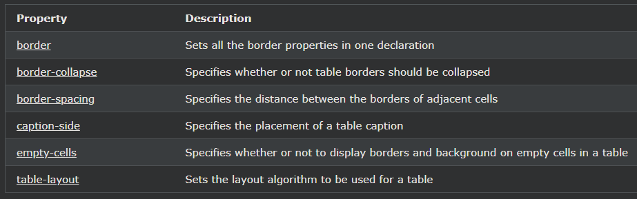

## CSS Responsive Table

---

### 반응형 테이블

화면이 너무 작아 전체 콘텐츠를 표시할 수 없는 경우 반응형 테이블에 가로 스크롤 막대가 표시됩니다.

overflow-x:auto는 \<table> 요소 주위에 컨테이너 요소(예: \
)를 추가하여 반응형으로 만듭니다.

    예시

    

    <table>
    ... table content ...
    </table>

    

참고: OS X Lion(Mac)에서 스크롤 막대는 "overflow:scroll"이 설정되어 있어도 기본적으로 숨겨져 있고 사용할 때만 표시됩니다.

---

### 더 많은 예

[멋진 테이블 만들기](https://www.w3schools.com/css/tryit.asp?filename=trycss_table_padding)
이 예에서는 멋진 테이블을 만드는 방법을 보여줍니다.

[테이블 캡션의 위치 설정](https://www.w3schools.com/css/tryit.asp?filename=trycss_table_fancy)
이 예에서는 테이블 캡션의 위치를 ​​지정하는 방법을 보여줍니다.

---

### CSS 테이블 속성

