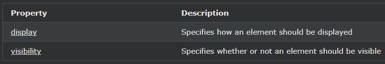

## CSS Layout - The display Property

display속성은 레이아웃을 제어하기위한 가장 중요한 CSS 속성입니다.

---

### 디스플레이 속성

display속성은 어떻게 요소가 표시될지 지정합니다.

모든 HTML 요소에는 요소 유형에 따라 기본 표시 값이 있습니다.

대부분의 요소에 대한 기본 표시 값은 block또는 inline입니다.

---

### 블록 수준 요소

블록 수준 요소는 항상 새 줄에서 시작하고 사용 가능한 전체 너비를 차지합니다(가능한 한 왼쪽과 오른쪽으로 늘어남).

    

    <h1> - <h6>
    

    <form>
    <header>
    <footer>
    <section>

---

### 인라인 요소

인라인 요소는 새 줄에서 시작하지 않고 필요한 만큼만 너비를 차지합니다.

    
    <a>
    

---

### Display: none;

display: none;삭제 및 재생성 없이 요소를 숨기고 표시하기 위해 JavaScript와 함께 일반적으로 사용됩니다.

\<script> 요소는 display: none (기본값)을 사용합니다.

---

### 기본 표시 값 무시

언급했듯이 모든 요소에는 기본 표시 값이 있습니다. 그러나 이를 재정의할 수 있습니다.

인라인 요소를 블록 요소로 변경하거나 그 반대로 변경하면 페이지가 특정 방식으로 보이도록 하면서도 여전히 웹 표준을 따르는 데 유용할 수 있습니다.

다음 예는 \<li>가로 메뉴에 대한 인라인 요소를 만드는 것입니다 .

    예시
    li {
    display: inline;
    }

참고: 요소의 표시 속성을 설정하면 요소가 표시되는 방식 만 변경 되며 어떤 종류의 요소인지는 변경 되지 않습니다. 따라서 인라인 요소 display: block;는 내부에 다른 블록 요소를 가질 수 없습니다.

다음 예에서는 \ 요소를 블록 요소로 표시합니다.

    예시
    span {
    display: block;
    }

다음 예에서는 \<a> 요소를 블록 요소로 표시합니다.

    예시
    a {
    display: block;
    }

---

### 요소를 숨기고 싶어요 - display:none or visibility:hidden?

display속성을 none으로 설정하여 요소를 숨길 수 있습니다. 요소가 숨겨지고 요소가 없는 것처럼 페이지가 표시됩니다.

    예시
    h1.hidden {
    display: none;
    }

visibility:hidden; 또한 요소를 숨깁니다.

그러나 요소는 여전히 이전과 동일한 공간을 차지합니다. 요소는 숨겨지지만 여전히 레이아웃에 영향을 줍니다.

    예시
    h1.hidden {
    visibility: hidden;
    }

---

### More Examples

[Differences between display: none; and visibility: hidden;](https://www.w3schools.com/css/tryit.asp?filename=trycss_display)

This example demonstrates display: none; versus visibility: hidden;

[Using CSS together with JavaScript to show content](https://www.w3schools.com/css/tryit.asp?filename=trycss_display_js)

This example demonstrates how to use CSS and JavaScript to show an element on click.

---

### CSS Display/Visibility Properties

