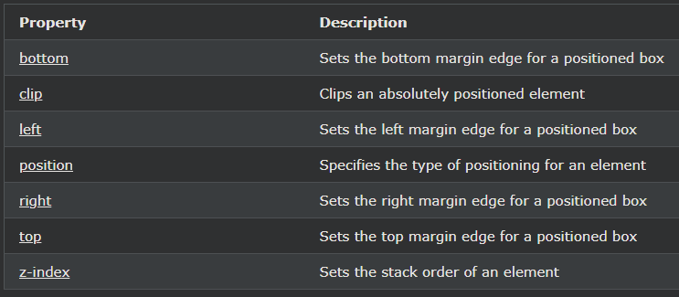

## CSS Layout - The position Property

position속성을 지정하는 요소 (static, relative, fixed, absolute or sticky)에 사용되는 측위 방법의 유형.

---

### The position Property

position속성은 요소에 사용될 위치 확인 방법의 타입을 지정한다.

5가지 다른 위치 값이 있습니다.

- static
- relative
- fixed
- absolute
- sticky

그런 다음 요소는 top, bottom, left 및 right 속성을 사용하여 배치됩니다. 그러나 이러한 속성은 position 속성을 먼저 설정 하지 않으면 작동하지 않습니다 . 또한 위치 값에 따라 다르게 작동합니다.

---

### position: static;

HTML 요소는 기본적으로 정적으로 배치됩니다.

정적 위치 요소는 top, bottom, left, right 속성의 영향을 받지 않습니다.

가 있는 요소 position: static;는 특별한 방식으로 배치되지 않습니다. 항상 페이지의 정상적인 흐름에 따라 배치됩니다.

---

### position: relative;

position: relative;가 있는 요소는 정상 위치를 기준으로 배치됩니다.

상대적으로 배치된 요소의 top, right, bottom, left 속성을 설정하면 원래 위치에서 멀어지게 조정됩니다. 다른 콘텐츠는 요소에 의해 남겨진 간격에 맞게 조정되지 않습니다.

---

### position:fixed;

position: fixed;가 있는 요소는 뷰포트에 상대적으로 위치하므로 페이지를 스크롤하더라도 항상 같은 위치에 유지됩니다. top, right, bottom, left 속성은 요소의 위치를 ​​지정하는 데 사용됩니다.

고정 요소는 일반적으로 위치했을 페이지에 공백을 남기지 않습니다.

---

### position:absolute;

position: absolute;가 있는 요소는 가장 가까운 위치에 있는 부모요소를 기준으로 배치됩니다(고정처럼 뷰포트에 상대적으로 배치되는 대신).

그러나 절대 위치 요소에 상위 항목이 없는 경우 문서 본문을 사용하고 페이지 스크롤과 함께 이동합니다.

참고: 절대 위치 요소는 일반 흐름에서 제거되며 요소와 겹칠 수 있습니다.

---

### position:sticky;

position: sticky;가 있는 요소는 사용자의 스크롤 위치를 기준으로 배치됩니다.

스티커 요소는 스크롤 위치에 따라 상대 요소와 고정 요소를 전환합니다. 뷰포트에서 주어진 오프셋 위치가 충족될 때까지 상대적인 위치에 배치된 다음 제자리에 "스틱"합니다(예: position:fixed;).

 
참고: Internet Explorer는 고정 위치 지정을 지원하지 않습니다. Safari에는 -webkit- 접두사가 필요합니다(아래 예 참조). 또한 중 적어도 하나에 지정해야합니다 top, right, bottom또는 left작업에 끈적 위치 결정.

---

### Overlapping Elements

요소를 배치하면 다른 요소와 겹칠 수 있습니다.

z-index 속성은 요소의 스택 순서(다른 요소 앞 또는 뒤에 배치해야 하는 요소)를 지정합니다.

요소의 스택 순서는 양수 또는 음수일 수 있습니다.

스택 순서가 더 큰 요소는 항상 스택 순서가 낮은 요소 앞에 있습니다.

 

참고: 두 개의 배치된 요소가 z-index 지정 되지 않고 겹치는 경우 HTML 코드에서 마지막에 위치한 요소가 맨 위에 표시됩니다.

---

### 모든 CSS 위치 지정 속성

