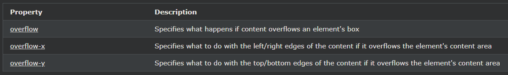

## CSS Layout - Overflow

CSS overflow 속성은 너무 커서 영역에 맞지 않는 콘텐츠도 제어합니다.

---

### CSS 오버플로

overflow속성은 요소의 내용이 지정된 영역에 맞지 않을 때 내용을 자를지 또는 스크롤 막대를 추가할지 여부를 지정합니다.

overflow속성:

- visible- 기본. 오버플로가 잘리지 않습니다. 콘텐츠는 요소 상자 외부에서 렌더링됩니다.
- hidden - 오버플로가 잘리고 나머지 내용은 보이지 않습니다.
- scroll - 오버플로가 잘리고 스크롤바가 추가되어 나머지 내용을 볼 수 있습니다.
- auto - scroll과 유사 하지만 필요할 때만 스크롤바를 추가합니다.

참고 :overflow 요소는 지정된 높이 블록 요소에 적용됩니다.

참고: OS X Lion(Mac)에서 스크롤 막대는 "overflow:scroll"이 설정되어 있어도 기본적으로 숨겨져 있고 사용할 때만 표시됩니다.

---

### overflow: visible

기본적으로 오버플로는 visible, 잘리지 않고 요소 상자 외부에서 렌더링됨을 의미합니다.

    예시
    div {
    width: 200px;
    height: 50px;
    background-color: #eee;
    overflow: visible;
    }

---

### overflow: hidden

hidden값 으로, 오버 플로우가 잘리고, 콘텐츠의 나머지는 숨겨져 있습니다

    예시
    div {
    overflow: hidden;
    }

---

### overflow: scroll

값을 scroll로 설정하면 오버플로가 잘리고 스크롤 막대가 추가되어 상자 내부를 스크롤합니다. 이것은 필요하지 않더라도 스크롤바를 가로 및 세로로 추가합니다

    예시
    div {
    overflow: scroll;
    }

---

### overflow: auto

auto는 scroll과 유사 하지만, 필요한 경우에만 스크롤바를 추가합니다

    예시
    div {
    overflow: auto;
    }

---

### overflow-x and overflow-y

overflow-x및 overflow-y(또는 둘 다)속성은 단지 수평 또는 수직 콘텐츠 플로우를 변경할 것인지 지정합니다

overflow-x콘텐츠의 왼쪽/오른쪽 가장자리로 수행할 작업을 지정합니다.
overflow-y콘텐츠의 위쪽/아래쪽 가장자리로 수행할 작업을 지정합니다.

    예시
    div {
    overflow-x: hidden; /* Hide horizontal scrollbar */
    overflow-y: scroll; /* Add vertical scrollbar */
    }

---

### 모든 CSS 오버플로 속성

