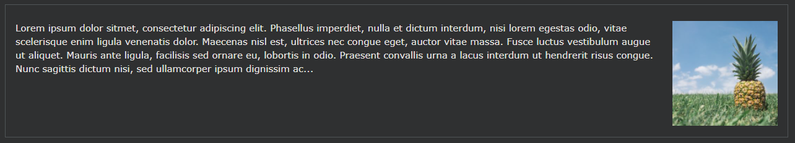
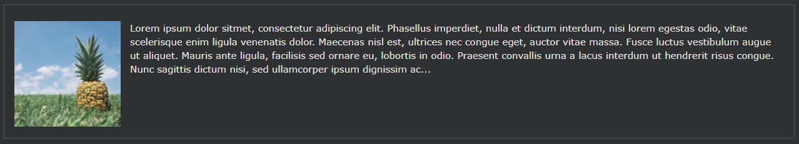
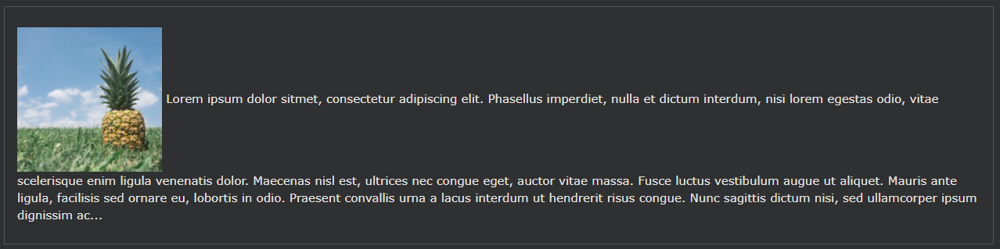

## CSS Layout - float and clear

CSS float속성은 요소가 어떻게 떠야 하는지를 지정합니다.

CSS clear속성은 지워진 요소 옆과 어느 쪽에 떠 있을 수 있는지 지정합니다.

---

### float 속성

이 float속성은 콘텐츠의 위치를 ​​지정하고 서식을 지정하는 데 사용됩니다. 예를 들어 이미지가 컨테이너의 텍스트 왼쪽에 떠 있게 합니다.

float속성은 다음 값 중 하나를 가질 수 있습니다 :

- left - 요소는 컨테이너의 왼쪽에 떠 있습니다.
- right - 요소는 컨테이너의 오른쪽에 떠 있습니다.
- none- 요소가 부동하지 않습니다(텍스트에서 발생한 위치에 바로 표시됨). 이것은 기본값입니다
- inherit - 요소는 부모의 float 값을 상속합니다.

가장 간단한 용도로 float속성을 사용하여 이미지 주위에 텍스트를 줄 바꿈할 수 있습니다.

---

### float: right;

다음 예제는 이미지가 텍스트 에서 오른쪽 으로 떠 있도록 지정 합니다.

    예시
    img {
    float: right;
    }

---

### float: left;

다음 예제는 이미지가 텍스트 에서 왼쪽 으로 떠 있도록 지정 합니다.

    img {
    float: left;
    }

---

### No float

다음 예에서 이미지는 텍스트에서 나타나는 바로 그 위치에 표시됩니다(float: none;):

    예시
    img {
    float: none;
    }

---

### Float Next To Each Other

일반적으로 div 요소는 서로 위에 표시됩니다. 그러나 float: left를 사용하면 요소가 서로 옆에 떠 있게 할 수 있습니다.

    예시
    div {
    float: left;
    padding: 15px;
    }

    .div1 {
    background: red;
    }

    .div2 {
    background: yellow;
    }

    .div3 {
    background: green;
    }
