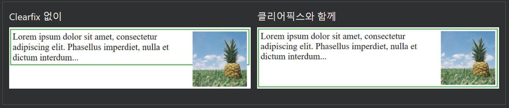

## CSS 레이아웃 - 가로 및 세로 정렬

---

### 중심 정렬 요소

블록 요소(예: \
)를 수평으로 가운데에 맞추려면 다음을 사용하십시오. margin: auto;

요소의 너비를 설정하면 요소가 컨테이너의 가장자리까지 늘어나는 것을 방지할 수 있습니다.

그러면 요소가 지정된 너비를 차지하고 나머지 공간이 두 여백 사이에 균등하게 분할됩니다.

    예시
    .center {
    margin: auto;
    width: 50%;
    border: 3px solid green;
    padding: 10px;
    }

참고:width 속성이 설정되지 않은 경우 (또는 100%로 설정되는 경우) 가운데 맞춤은 효과가 없습니다.

---

### 텍스트 가운데 맞춤

요소 내부의 텍스트를 가운데에 맞추려면 다음을 사용하십시오. text-align: center;

    예시
    .center {
    text-align: center;
    border: 3px solid green;
    }

팁: 텍스트를 정렬하는 방법에 대한 더 많은 예는 [CSS 텍스트 장](https://www.w3schools.com/css/css_text.asp)을 참조하십시오 .

---

### 이미지 중앙에 맞추기

이미지를 가운데에 맞추려면 왼쪽 및 오른쪽 여백을 auto로 설정하고 block요소 로 만듭니다 .

    예시
    img {
    display: block;
    margin-left: auto;
    margin-right: auto;
    width: 40%;
    }

---

### 왼쪽 및 오른쪽 정렬 - 위치 사용

요소를 정렬하는 한 가지 방법은 다음을 사용하는 것입니다 position: absolute;.

    예시
    .right {
    position: absolute;
    right: 0px;
    width: 300px;
    border: 3px solid #73AD21;
    padding: 10px;
    }

참고: position: absolute; 요소는 일반 흐름에서 제거되며 요소와 겹칠 수 있습니다.

---

### 왼쪽 및 오른쪽 정렬 - float

요소를 정렬하는 또 다른 방법은 float속성 을 사용하는 것입니다 .

예시
.right {
float: right;
width: 300px;
border: 3px solid #73AD21;
padding: 10px;
}

---

### clearfix hack

참고: 요소가 포함된 요소보다 키가 크고 떠 있는 경우 컨테이너 외부에서 오버플로됩니다. "clearfix hack"을 사용하여 이 문제를 해결할 수 있습니다(아래 예 참조).

그런 다음 이 문제를 해결하기 위해 포함하는 요소에 clearfix hack을 추가할 수 있습니다.

    예시
    .clearfix::after {
    content: "";
    clear: both;
    display: table;
    }

---

### 세로 중앙 - 패딩 사용

CSS에서 요소를 세로로 가운데에 맞추는 방법에는 여러 가지가 있습니다.

간단한 해결책은 top 및 bottom padding을 사용하는 것입니다.

    예시
    .center {
    padding: 70px 0;
    border: 3px solid green;
    }

수직 및 수평으로 모두 중앙에, 사용 padding및 text-align: center

    예시
    .center {
    padding: 70px 0;
    border: 3px solid green;
    text-align: center;
    }

---

### 세로 중앙 - 선 높이 사용

또 다른 트릭은 line-height속성과 동일한 값으로 height속성 을 사용하는 것입니다.

    예시
    .center {
    line-height: 200px;
    height: 200px;
    border: 3px solid green;
    text-align: center;
    }

    /* If the text has multiple lines, add the following: */
    .center p {
    line-height: 1.5;
    display: inline-block;
    vertical-align: middle;
    }

---

### 수직 중심 - 위치 및 변환 사용

padding및 line-height 옵션이 아닌 경우 다른 솔루션은 위치 지정 및 transform속성 을 사용하는 것입니다 .

    예시
    .center {
    height: 200px;
    position: relative;
    border: 3px solid green;
    }

    .center p {
    margin: 0;
    position: absolute;
    top: 50%;
    left: 50%;
    transform: translate(-50%, -50%);
    }

---

### 수직 중앙 - Flexbox 사용

flexbox를 사용하여 사물을 중앙에 둘 수도 있습니다. flexbox는 IE10 및 이전 버전에서 지원되지 않습니다.

    예시
    .center {
    display: flex;
    justify-content: center;
    align-items: center;
    height: 200px;
    border: 3px solid green;
    }

팁: Flexbox에 대한 자세한 내용은 [CSS Flexbox 장](https://www.w3schools.com/css/css3_flexbox.asp)을 참조하십시오 .
