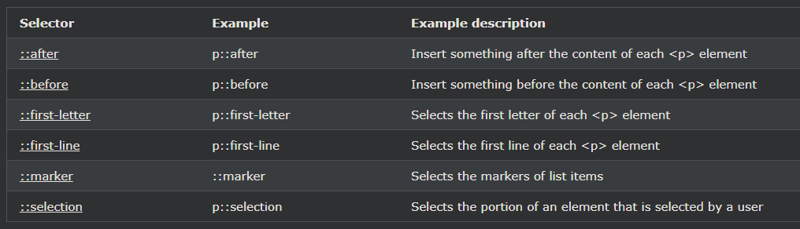

## CSS Pseudo-elements

---

### 의사 요소 란 무엇입니까?

CSS 의사 요소는 요소의 지정된 부분에 스타일을 지정하는 데 사용됩니다.

예를 들어 다음과 같은 용도로 사용할 수 있습니다.

- 요소의 첫 글자 또는 줄 스타일 지정
- 요소의 내용 앞이나 뒤에 내용 삽입

---

### The ::first-line Pseudo-element

::first-line의사 요소는 텍스트의 첫 번째 줄에 특별한 스타일을 추가하는 데 사용됩니다.

다음 예제에서는 모든 \
 요소에 있는 텍스트의 첫 번째 줄에 서식을 지정합니다.

    예시
    p::first-line {
    color: #ff0000;
    font-variant: small-caps;
    }

가상 요소 ::first-line만 블록 레벨 요소에 적용될 수있다.

::first-line 의사 요소 에는 다음 속성이 적용됩니다 .

- font properties
- color properties
- background properties
- word-spacing
- letter-spacing
- text-decoration
- vertical-align
- text-transform
- line-height
- clear

  이중 콜론 표기를 주목하라 - ::first-line VS :first-line

  이중 콜론 CSS3의 의사 요소에 대한 단일 콜론 표기를 교체했다.

  이것은 의사 클래스 와 의사 요소 를 구별하기 위한 W3C의 시도였습니다 .

  단일 콜론 구문은 CSS2 및 CSS1에서 의사 클래스와 의사 요소 모두에 사용되었습니다.

  이전 버전과의 호환성을 위해 단일 콜론 구문은 CSS2 및 CSS1 의사 요소에 대해 허용됩니다.

---

### 첫 글자 의사 요소

::first-letter의사 요소는 텍스트의 첫 글자에 특별한 스타일을 추가하는 데 사용됩니다.

다음 예제에서는 모든 \
 요소에 있는 텍스트의 첫 글자에 서식을 지정합니다.

    예시
    p::first-letter {
    color: #ff0000;
    font-size: xx-large;
    }

가상 요소 ::first-letter 만 블록 레벨 요소에 적용될 수있다.

다음 속성은 ::first-letter 의사 요소에 적용됩니다.

- font properties
- color properties
- background properties
- margin properties
- padding properties
- border properties
- text-decoration
- vertical-align (only if "float" is "none")
- text-transform
- line-height
- float
- clear

---

### 의사 요소 및 HTML 클래스

의사 요소는 HTML 클래스와 결합할 수 있습니다.

    예시
    p.intro::first-letter {
    color: #ff0000;
    font-size: 200%;
    }

위의 예는 class="intro"인 단락의 첫 글자를 빨간색으로 더 큰 크기로 표시합니다.

---

### 다중 의사 요소

여러 유사 요소를 결합할 수도 있습니다.

다음 예에서 단락의 첫 글자는 xx-large 글꼴 크기에서 빨간색입니다. 첫 번째 줄의 나머지 부분은 파란색으로 작은 대문자로 표시됩니다. 단락의 나머지 부분은 기본 글꼴 크기와 색상이 됩니다.

    예시
    p::first-letter {
    color: #ff0000;
    font-size: xx-large;
    }

    p::first-line {
    color: #0000ff;
    font-variant: small-caps;
    }

---

### CSS - ::before Pseudo-element

::before의사 요소는 요소의 내용 이전에 일부 내용을 삽입 할 수 있습니다.

다음 예제에서는 각 \<h1> 요소의 내용 앞에 이미지를 삽입합니다.

    예시
    h1::before {
    content: url(smiley.gif);
    }

---

### CSS - ::after 의사 요소

::after가상 요소는 요소의 내용 후 일부 콘텐츠를 삽입하는데 사용될 수있다.

다음 예에서는 각 \<h1> 요소의 내용 뒤에 이미지를 삽입합니다.

    예시
    h1::after {
    content: url(smiley.gif);
    }

---

### CSS - ::marker 의사 요소

::marker가상 요소는리스트 항목의 마커를 선택한다.

다음 예제에서는 목록 항목의 마커 스타일을 지정합니다.

    예시
    ::marker {
    color: red;
    font-size: 23px;
    }

---

### CSS - ::selection 의사 요소

::selection가상 요소는 사용자에 의해 선택되는 요소의 부분과 일치한다.

다음 CSS 속성에 적용 할 수 있습니다 ::selection: color, background, cursor,와 outline.

다음 예에서는 선택한 텍스트를 노란색 배경에 빨간색으로 만듭니다.

    예시
    ::selection {
    color: red;
    background: yellow;
    }

---

### 모든 CSS 유사 요소

---

### All CSS Pseudo Classes

| Selector             | Example               | Example description                                                                                    |
| -------------------- | --------------------- | ------------------------------------------------------------------------------------------------------ |
| :active              | a:active              | Selects the active link                                                                                |
| :checked             | input:checked         | Selects every checked \<input> element                                                                 |
| :disabled            | input:disabled        | Selects every disabled \<input> element                                                                |
| :empty               | p:empty               | Selects every \
 element that has no children                                                        |
| :enabled             | input:enabled         | Selects every enabled \<input> element                                                                 |
| :first-child         | p:first-child         | Selects every \
 elements that is the first child of its parent                                      |
| :first-of-type       | p:first-of-type       | Selects every \
 element that is the first \
 element of its parent                                |
| :focus               | input:focus           | Selects the \<input> element that has focus                                                            |
| :hover               | a:hover               | Selects links on mouse over                                                                            |
| :in-range            | input:in-range        | Selects \<input> elements with a value within a specified range                                        |
| :invalid             | input:invalid         | Selects all \<input> elements with an invalid value                                                    |
| :lang(language)      | p:lang(it)            | Selects every \
 element with a lang attribute value starting with "it"                              |
| :last-child          | p:last-child          | Selects every \
 elements that is the last child of its parent                                       |
| :last-of-type        | p:last-of-type        | Selects every \
 element that is the last \
 element of its parent                                 |
| :link                | a:link                | Selects all unvisited links                                                                            |
| :not(selector)       | :not(p)               | Selects every element that is not a \
 element                                                       |
| :nth-child(n)        | p:nth-child(2)        | Selects every \
 element that is the second child of its parent                                      |
| :nth-last-child(n)   | p:nth-last-child(2)   | Selects every \
 element that is the second child of its parent, counting from the last child        |
| :nth-last-of-type(n) | p:nth-last-of-type(2) | Selects every \
 element that is the second \
 element of its parent, counting from the last child |
| :nth-of-type(n)      | p:nth-of-type(2)      | Selects every \
 element that is the second \
 element of its parent                               |
| :only-of-type        | p:only-of-type        | Selects every \
 element that is the only \
 element of its parent                                 |
| :only-child          | p:only-child          | Selects every \
 element that is the only child of its parent                                        |
| :optional            | input:optional        | Selects \<input> elements with no "required" attribute                                                 |
| :out-of-range        | input:out-of-range    | Selects \<input> elements with a value outside a specified range                                       |
| :read-only           | input:read-only       | Selects \<input> elements with a "readonly" attribute specified                                        |
| :read-write          | input:read-write      | Selects \<input> elements with no "readonly" attribute                                                 |
| :required            | input:required        | Selects \<input> elements with a "required" attribute specified                                        |
| :root                | root                  | Selects the document's root element                                                                    |
| :target              | #news:target          | Selects the current active #news element (clicked on a URL containing that anchor name)                |
| :valid               | input:valid           | Selects all \<input> elements with a valid value                                                       |
| :visited             | a:visited             | Selects all visited links                                                                              |
