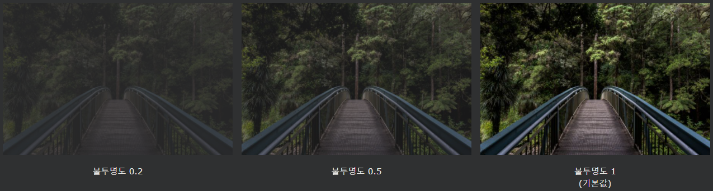
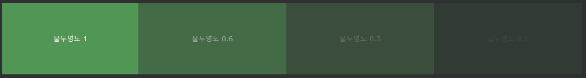
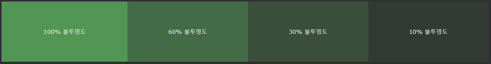
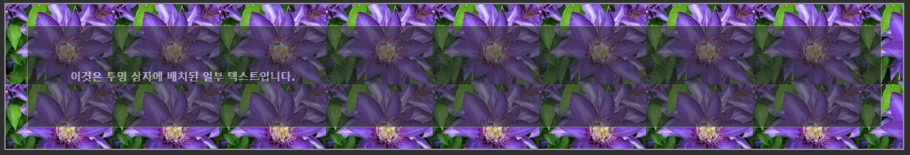

## CSS 불투명도/투명도

opacity속성은 요소의 불투명도 / 투명도를 지정합니다.

---

### 투명한 이미지

opacity속성은 0.0의 값을 취할 수 - 1.0. 값이 낮을수록 더 투명해집니다.

    예시
    img {
    opacity: 0.5;
    }

---

### 투명 호버 효과

불투명도 속성은 종종 마우스 오버의 불투명도를 변경하기 위해 :hover 선택기와 함께 사용됩니다.

    예시
    img {
    opacity: 0.5;
    }

    img:hover {
    opacity: 1.0;
    }

---

### 투명 상자

opacity속성을 사용하여 요소의 배경에 투명도를 추가하면 모든 하위 요소가 동일한 투명도를 상속합니다. 이렇게 하면 완전히 투명한 요소 안의 텍스트를 읽기 어렵게 만들 수 있습니다.

    예시
    div {
    opacity: 0.3;
    }

---

### RGBA를 사용한 투명도

위의 예와 같이 하위 요소에 불투명도를 적용하지 않으려면 RGBA 색상 값을 사용하십시오. 다음 예제에서는 텍스트가 아닌 배경색의 불투명도를 설정합니다.

RGB 외에도 색상의 불투명도를 지정하는 알파 채널(RGBA)과 함께 RGB 색상 값을 사용할 수 있습니다.

RGBA 색상 값은 rgba(red, green, blue, alpha )로 지정됩니다. 알파 파라미터는 0.0 (완전히 투명), 1.0 (완전 불투명) 사이의 수 입니다.

    예시
    div {
    background: rgba(76, 175, 80, 0.3) /* Green background with 30% opacity */
    }

---

### 투명 상자의 텍스트

[예시](W3_CSS_day63.html)
