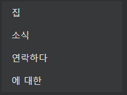
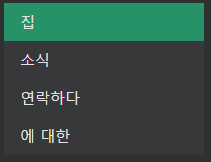
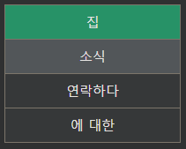
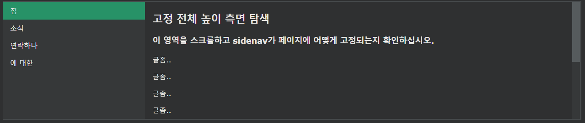

## CSS Vertical Navigation Bar

---

### Vertical Navigation Bar

수직 탐색 모음을 작성하려면 이전 페이지의 코드 외에도 목록 내부의 \<a> 요소에 스타일을 지정할 수 있습니다.

    예시
    li a {
    display: block;
    width: 60px;
    }

예시 설명:

- display: block; - 링크를 블록 요소로 표시하면 전체 링크 영역(텍스트뿐만 아니라)을 클릭할 수 있으며 너비(원하는 경우 패딩, 여백, 높이 등)를 지정할 수 있습니다.
- width: 60px; - 블록 요소는 기본적으로 사용 가능한 전체 너비를 차지합니다. 60픽셀 너비를 지정하고 싶습니다.

\<ul>의 너비를 설정하고 \<a>의 너비를 제거할 수도 있습니다. 이는 블록 요소로 표시될 때 사용 가능한 전체 너비를 차지하기 때문입니다. 이것은 이전 예와 동일한 결과를 생성합니다:

    예시
    ul {
    list-style-type: none;
    margin: 0;
    padding: 0;
    width: 60px;
    }

    li a {
    display: block;
    }

---

### Vertical Navigation Bar Examples

회색 배경색으로 기본 수직 탐색 모음을 만들고 사용자가 링크 위로 마우스를 이동할 때 링크의 배경색을 변경합니다.

    예시
    ul {
    list-style-type: none;
    margin: 0;
    padding: 0;
    width: 200px;
    background-color: #f1f1f1;
    }

    li a {
    display: block;
    color: #000;
    padding: 8px 16px;
    text-decoration: none;
    }

    /* Change the link color on hover */
    li a:hover {
    background-color: #555;
    color: white;
    }

---

### Active/Current Navigation Link

현재 링크에 "activate" 클래스를 추가하여 사용자가 현재 있는 페이지를 알 수 있도록 합니다.

    예시
    .active {
    background-color: #04AA6D;
    color: white;
    }

---

### Center Links & Add Borders

text-align:center를 \<li> 또는 \<a>에 추가 하여 링크를 중앙에 배치합니다.

border 속성을 \<ul>에 추가하여 탐색바 주위에 테두리를 추가합니다. 또한 탐색바 내부에 테두리를 만들려면 마지막 요소를 제외한 모든 \<li> 요소에 border-bottom 부분을 추가합니다.

    예시
    ul {
    border: 1px solid #555;
    }

    li {
    text-align: center;
    border-bottom: 1px solid #555;
    }

    li:last-child {
    border-bottom: none;
    }

---

### Full-height Fixed Vertical Navbar

    예시
    ul {
    list-style-type: none;
    margin: 0;
    padding: 0;
    width: 25%;
    background-color: #f1f1f1;
    height: 100%; /* Full height */
    position: fixed; /* Make it stick, even on scroll */
    overflow: auto; /* Enable scrolling if the sidenav has too much content */
    }
