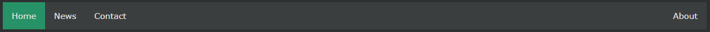

## CSS Horizontal Navigation Bar

---

### Horizontal Navigation Bar

수평 탐색 막대를 만드는 두 가지 방법이 있습니다. 인라인 또는 부동 목록 항목을 사용합니다.

 

### Inline List Items

수평 탐색 모음을 만드는 한 가지 방법은 이전 페이지의 "표준" 코드 외에 \<li> 요소를 인라인으로 지정하는 것입니다.

    li {
    display: inline;
    }

- display: inline;- 기본적으로 \<li> 요소는 블록 요소입니다. 여기에서는 각 목록 항목 전후에 줄 바꿈을 제거하여 한 줄에 표시합니다.

 

### 플로팅 목록 항목

수평 탐색 모음을 만드는 또 다른 방법은 \<li> 요소를 띄우고 탐색 링크의 레이아웃을 지정하는 것입니다.

    li {
    float: left;
    }

    a {
    display: block;
    padding: 8px;
    background-color: #dddddd;
    }

- float: left; - float를 사용하여 블록 요소가 서로 옆에 떠 있게 합니다.
- display: block; - 패딩(원하는 경우 높이, 너비, 여백 등)을 지정할 수 있습니다.
- padding: 8px; - 각 \<a> 요소 사이에 패딩을 지정하여 보기 좋게 만듭니다.
- background-color: #dddddd; - 각 \<a> 요소에 회색 배경색 추가

팁: 전체 너비의 배경색을 원하면 각 \<a> 요소 대신 \<ul>에 background-color를 추가하십시오.

    ul {
    background-color: #dddddd;
    }

---

### Horizontal Navigation Bar Examples

어두운 배경색으로 기본 수평 탐색 모음을 만들고 사용자가 링크 위로 마우스를 이동할 때 링크의 배경색을 변경합니다.

    예시
    ul {
    list-style-type: none;
    margin: 0;
    padding: 0;
    overflow: hidden;
    background-color: #333;
    }

    li {
    float: left;
    }

    li a {
    display: block;
    color: white;
    text-align: center;
    padding: 14px 16px;
    text-decoration: none;
    }

    /* Change the link color to #111 (black) on hover */
    li a:hover {
    background-color: #111;
    }

 

### Active/Current Navigation Link

현재 링크에 "활성" 클래스를 추가하여 사용자가 현재 있는 페이지를 알 수 있도록 합니다.

    .active {
    background-color: #04AA6D;
    }

 

### 오른쪽 정렬 링크

목록 항목을 오른쪽( float:right;) 으로 이동하여 링크를 오른쪽 정렬

    <ul>
    <li><a href="#home">Home</a></li>
    <li><a href="#news">News</a></li>
    <li><a href="#contact">Contact</a></li>
    <li style="float:right"><a class="active" href="#about">About</a></li>
    </ul>

 

### Border Dividers

\<li>에 border-right 속성을 추가하여 링크 구분선을 만듭니다.

    /* Add a gray right border to all list items, except the last item (last-child) */
    li {
    border-right: 1px solid #bbb;
    }

    li:last-child {
    border-right: none;
    }

 

### Fixed Navigation Bar

사용자가 페이지를 스크롤하는 경우에도 네비바가 페이지의 상단 또는 하단에 유지되도록 합니다.

    Fixed Top
    ul {
    position: fixed;
    top: 0;
    width: 100%;
    }

    Fixed Bottom
    ul {
    position: fixed;
    bottom: 0;
    width: 100%;
    }

참고: 고정 위치는 모바일 장치에서 제대로 작동하지 않을 수 있습니다.

 

### Gray Horizontal Navbar

얇은 회색 테두리가 있는 수평 네비바

    ul {
    border: 1px solid #e7e7e7;
    background-color: #f3f3f3;
    }

    li a {
    color: #666;
    }

 

### Sticky Navbar

고정 네비바를 만들려면 \<ul>에 position: sticky;를 추가 하세요

고정 요소는 스크롤 위치에 따라 상대 요소와 고정 요소 사이를 전환합니다. 주어진 오프셋 위치가 뷰포트에서 만날 때까지 상대적으로 배치된 다음 제자리에 "고정"됩니다(예: position:fixed).

    예시
    ul {
    position: -webkit-sticky; /_ Safari _/
    position: sticky;
    top: 0;
    }
