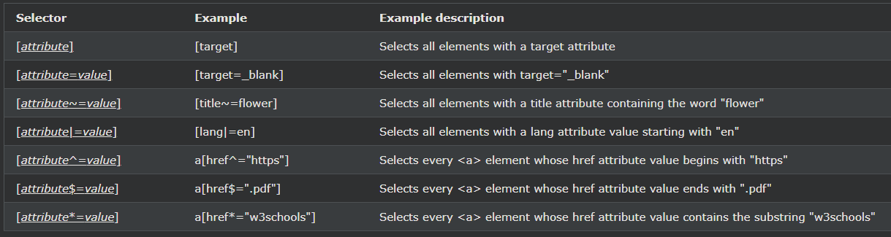

## CSS Attribute Selectors

---

### 특정 속성으로 HTML 요소 스타일 지정

특정 속성 또는 속성 값이 있는 HTML 요소의 스타일을 지정할 수 있습니다.

---

### CSS [attribute] Selector

[attribute]선택기는 특정 속성을 가진 요소를 선택하는 데 사용된다.

다음 예에서는 대상 속성이 있는 모든 \<a> 요소를 선택합니다.

    예시
    a[target] {
    background-color: yellow;
    }

---

### CSS [속성="값"] 선택기

[attribute="value"]선택기는 특정 속성 및 값을 가진 요소를 선택하는 데 사용된다.

다음 예에서는 target="\_blank" 속성이 있는 모든 \<a> 요소를 선택합니다.

    예시
    a[target="_blank"] {
    background-color: yellow;
    }

---

### CSS [속성*="값"] 선택기

[attribute*="value"]선택기 속성 값이 소정 값을 포함하는 선택 요소로 사용된다.

다음 예제는 "te"가 포함된 클래스 속성 값을 가진 모든 요소를 ​​선택합니다.

참고: 값이 전체 단어일 필요는 없습니다!

    예시
    [class*="te"] {
    background: yellow;
    }

---

### CSS [속성~="값"] 선택기

[attribute~="value"]선택기는 특정 단어를 포함하는 속성 값을 가진 요소를 선택하는 데 사용된다.

다음 예는 공백으로 구분된 단어 목록(그 중 하나는 "꽃")을 '포함'하는 제목 속성을 가진 모든 요소를 ​​선택합니다.

    예시
    [title~="flower"] {
    border: 5px solid yellow;
    }

위의 예는 title="flower", title="summer flower" 및 title="flower new"인 요소와 일치하지만 title="my-flower" 또는 title="flowers"는 일치하지 않습니다.

---

### CSS [속성|="값"] 선택기

[attribute|="value"]선택기 지정된 값으로 시작하는 지정된 속성 요소를 선택하는 데 사용된다.

다음 예제에서는 "top"으로 시작하는 클래스 속성 값이 있는 모든 요소를 ​​선택합니다.

참고: 값은 class="top"과 같이 단독으로 사용하거나 class="top-text"와 같이 하이픈( - )이 뒤에 오는 전체 단어여야 합니다!

    예시
    [class|="top"] {
    background: yellow;
    }

---

### CSS [속성^="값"] 선택기

[attribute^="value"]선택기 속성 값이 지정된 값으로 시작 선택 소자에 사용된다.

다음 예제에서는 "top"으로 시작하는 클래스 속성 값이 있는 모든 요소를 ​​선택합니다.

참고: 값이 전체 단어일 필요는 없습니다!

    예시
    [class^="top"] {
    background: yellow;
    }

---

### CSS [attribute$="value"] 선택기

[attribute$="value"]선택기 속성 값이 지정된 값의 단부 선택 소자에 사용된다.

다음 예제는 "test"로 끝나는 클래스 속성 값을 가진 모든 요소를 ​​선택합니다.

참고: 값이 전체 단어일 필요는 없습니다!

    예시
    [class$="test"] {
    background: yellow;
    }

---

### 스타일링 양식

위와 같은 속성 선택자는 클래스나 ID가 없는 양식의 스타일을 지정하는 데 유용할 수 있습니다.

    예시
    input[type="text"] {
    width: 150px;
    display: block;
    margin-bottom: 10px;
    background-color: yellow;
    }

    input[type="button"] {
    width: 120px;
    margin-left: 35px;
    display: block;
    }

---

### 모든 CSS 속성 선택기

