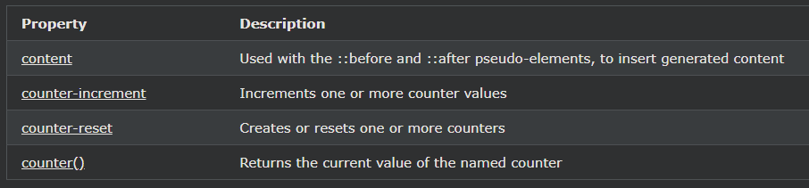

## CSS Counters

CSS 카운터는 CSS 규칙에 의해 값이 증가할 수 있는 CSS에서 유지 관리하는 "변수"입니다(사용 횟수를 추적하기 위해). 카운터를 사용하면 문서에서의 위치에 따라 내용의 모양을 조정할 수 있습니다.

---

### 카운터를 사용한 자동 번호 매기기

CSS 카운터는 "변수"와 같습니다. 변수 값은 CSS 규칙(사용 횟수를 추적함)에 의해 증가될 수 있습니다.

CSS 카운터로 작업하려면 다음 속성을 사용합니다.

- counter-reset - 카운터 생성 또는 재설정
- counter-increment - 카운터 값 증가
- content - 생성된 콘텐츠 삽입
- counter()또는 counters()함수 - 요소에 카운터 값을 추가합니다.

CSS 카운터를 사용하려면 먼저 counter-reset.

다음 예제에서는 페이지에 대한 카운터(본문 선택기에서)를 만든 다음 각 \<h2> 요소에 대한 카운터 값을 증가시키고

각 \<h2> 요소 의 시작 부분에 "Section \<value of the counter>:"을 추가합니다.

    예시
    body {
    counter-reset: section;
    }

    h2::before {
    counter-increment: section;
    content: "Section " counter(section) ": ";
    }

---

### 중첩 카운터

다음 예제에서는 페이지(섹션)에 대해 하나의 카운터를 만들고 각 \<h1> 요소(하위 섹션)에 대해 하나의 카운터를 만듭니다. "섹션" 카운터는 "Section \<value of the section counter>."이 있는 각 \<h1> 요소에 대해 계산되고 "하위 섹션" 카운터는 .\<value of the section counter>.\<value of the subsection counter>이 있는 각 \<h2> 요소에 대해 계산됩니다.

    예시
    body {
    counter-reset: section;
    }

    h1 {
    counter-reset: subsection;
    }

    h1::before {
    counter-increment: section;
    content: "Section " counter(section) ". ";
    }

    h2::before {
    counter-increment: subsection;
    content: counter(section) "." counter(subsection) " ";
    }

카운터의 새 인스턴스가 자식 요소에서 자동으로 생성되기 때문에 카운터는 개요 목록을 만드는 데에도 유용할 수 있습니다. 여기에서 counters()함수를 사용하여 서로 다른 수준의 중첩 카운터 사이에 문자열을 삽입합니다.

    예시
    ol {
    counter-reset: section;
    list-style-type: none;
    }

    li::before {
    counter-increment: section;
    content: counters(section,".") " ";
    }

---

### CSS Counter Properties

